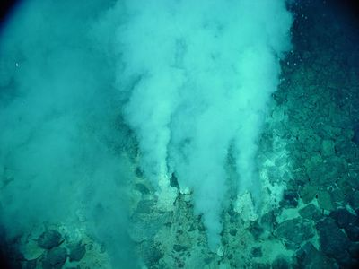

# 5. Hydrothermal Venture



> You come across a field of hydrothermal vents on the ocean floor! These vents constantly produce large, opaque clouds, so it would be best to avoid them if possible…

Advent of Code 2021 [Day 5](https://adventofcode.com/2021/day/5)

---

Each vent is defined by two co-ordinate pairs. We’ll represent the vents as a list of 2×2 matrices.

```q
q)show vents:{value"(",ssr[;"->";";"]x,")"}each read0 `:test5.txt
0 9 5 9
8 0 0 8
9 4 3 4
2 2 2 1
7 0 7 4
6 4 2 0
0 9 2 9
3 4 1 4
0 0 8 8
5 5 8 2
q)first vents
0 9
5 9
```


## Part 1

The second coords match so the first vent is a horizontal line through

```q
0 9
1 9
2 9
3 9
4 9
5 9
```

which we could express as `(range 0 5),'range 9 9`. We need only

```q
q)rng:{x+til y-x-1}  / ascending range
q)range:{@[;x](reverse rng reverse@;rng;first)2 sv(=;<).\:x}
q)range each (5 9;5 3;9 9)
5 6 7 8 9
5 4 3
9
```

to get the points crossed by a vent.

Note how range tests its argument pair for both equality and ascending, takes the resulting boolean pair as a decimal and indexes a list of three functions – equivalent to a case statement. But we can do better. If we move the test for equality into rng, both functions can be expressed with the ternary conditional Cond.

```q
q)rng:{$[x=y;x;x+til y-x-1]}.  / range (not descending)
q)range:{$[.[>]x;reverse rng reverse x;rng x]}
q)pts:{.[,']range each flip x}
q)([]v:vents;p:pts each vents)
v       p
---------------------------------------------
0 9 5 9 (0 9;1 9;2 9;3 9;4 9;5 9)
8 0 0 8 (8 0;7 1;6 2;5 3;4 4;3 5;2 6;1 7;0 8)
9 4 3 4 (9 4;8 4;7 4;6 4;5 4;4 4;3 4)
2 2 2 1 (2 2;2 1)
7 0 7 4 (7 0;7 1;7 2;7 3;7 4)
6 4 2 0 (6 4;5 3;4 2;3 1;2 0)
0 9 2 9 (0 9;1 9;2 9)
3 4 1 4 (3 4;2 4;1 4)
0 0 8 8 (0 0;1 1;2 2;3 3;4 4;5 5;6 6;7 7;8 8)
5 5 8 2 (5 5;6 4;7 3;8 2)
```

We notice with satisfaction that `pts` finds the points for diagonal vents as well as vertical and horizontal ones.

Find the points for just horizontal and vertical vents:

```q
q)vents where{any .[=]x}each vents
0 9 5 9
9 4 3 4
2 2 2 1
7 0 7 4
0 9 2 9
3 4 1 4

q)pts each vents where{any .[=]x}each vents
(0 9;1 9;2 9;3 9;4 9;5 9)
(9 4;8 4;7 4;6 4;5 4;4 4;3 4)
(2 2;2 1)
(7 0;7 1;7 2;7 3;7 4)
(0 9;1 9;2 9)
(3 4;2 4;1 4)

q)count each group raze pts each vents where{any .[=]x}each vents
0 9| 2
1 9| 2
2 9| 2
3 9| 1
4 9| 1
5 9| 1
9 4| 1
8 4| 1
7 4| 2
6 4| 1
5 4| 1
4 4| 1
3 4| 2
2 2| 1
2 1| 1
7 0| 1
7 1| 1
7 2| 1
7 3| 1
2 4| 1
1 4| 1
```

And count the points where vents overlap.

```q
q)plot:{count each group raze pts each x}
q)chp:{count where 1<x}  / count hot points
q)chp plot vents where {any .[=]x} each vents
5
```


## Part 2

The general case simply stops excluding the diagonal vents.

```q
q)chp plot vents
12
```

We can also check our work against the map. For this we’ll represent the 10×10 map as a 100-item vector and map the co-ordinate pairs into the range 0-99.

```q
q)flip " 1234"10 cut{@[100#0;key x;:;value x]}count each group 10 sv'raze pts each vents
"1 1    11 "
" 111   2  "
"  2 1 111 "
"   1 2 2  "
" 112313211"
"   1 2    "
"  1   1   "
" 1     1  "
"1       1 "
"222111    "
```

That leaves our complete solution:

```q
vents:{value"(",ssr[;"->";";"]x,")"}each read0 `$":input/05.txt"
rng:{$[x=y;x;x+til y-x-1]}.                                       / range (ascending only)
range:{$[.[>]x;reverse rng reverse x;rng x]}
pts:{.[,']range each flip x}                                      / points of a vent
plot:{count each group raze pts each x}
chp:{count where 1<x}                                             / count hot points

a[`$"5-1"]:chp plot vents where {any .[=]x} each vents
a[`$"5-2"]:chp plot vents
```