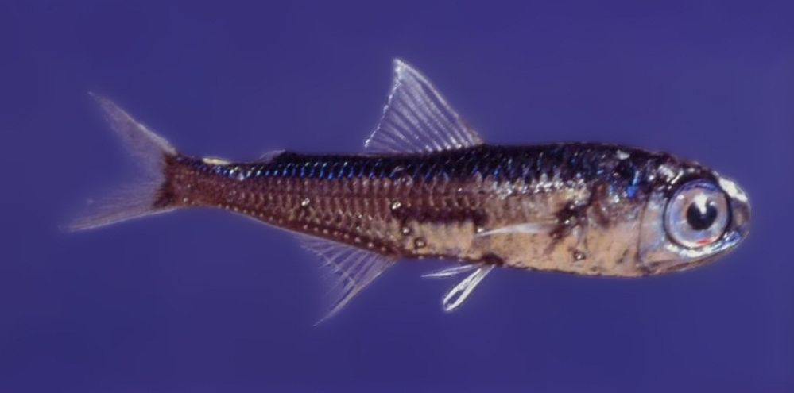

# 6. Lanternfish



> A massive school of glowing lanternfish swims past. They must spawn quickly to reach such large numbers – maybe **exponentially** quickly? You should model their growth rate to be sure…

Advent of Code 2021 [Day 6](https://adventofcode.com/2021/day/6)

---

## Part 1

It’s tempting to model the lanternfish population as a vector of timer states, subtracting 1 on each day, resetting each 0 to 6 and appending an 8. That lets us model progress day by day.

```q
q)3{,[;sum[n]#8] (x-1)+7*n:x=0}\3 4 3 1 2
3 4 3 1 2
2 3 2 0 1
1 2 1 6 0 8
0 1 0 5 6 7 8
```

And count them after 18 and 80 days.

```q
q)count 18{,[;sum[n]#8] (x-1)+7*n:x=0}/3 4 3 1 2
26
q)count 80{,[;sum[n]#8] (x-1)+7*n:x=0}/3 4 3 1 2
5934
```


## Part 2

But all this gets out of hand over 256 days as the vector count exceeds 26 billion.

A vector is an ordered list, but we do not need the lanternfish in any order. We need only represent how many fish have their timers in a given state. We could do this with a dictionary.

```q
q)count each group 3 4 3 1 2
3| 2
4| 1
1| 1
2| 1
```

But even this is more information than we need. There are only nine possible timer values. A vector of nine integers will number the fish at each timer state.

```q
q)show lf:@[9#0;;1+]3 4 3 1 2  / lanternfish school
0 1 1 2 1 0 0 0 0
```

Notice that, in the application of [Amend At](https://code.kx.com/q/ref/amend/) above, the index vector `3 4 3 1 2` contains two 3s. The unary third argument of Amend At, `1+`, is applied twice at index 3. The iteration is implicit in Amend At and need not be specified.

Now we represent a day’s count-down with a `1 rotate`, which happily rotates the fish with expired timers round to position 8. But position 8 represents newly spawned fish. So we need also to reset their parents’ timers by adding them at position 6.

```q
q)3 {@[1 rotate x;6;+;first x]}\ lf
0 1 1 2 1 0 0 0 0
1 1 2 1 0 0 0 0 0
1 2 1 0 0 0 1 0 1
2 1 0 0 0 1 1 1 1
```

Above, we used the Scan form of the [Do](https://code.kx.com/q/ref/accumulators/#do) iterator to apply the unary lambda `{@[1 rotate x;6;+;first x]}`, returning a list of the results of 0, 1, 2, and 3 iterations.

After the required iterations, count the fish with `sum`.

```q
q)sum 256{@[1 rotate x;6;+;x 0]}/ lf
26984457539
```

Above, we used the Over form of the Do iterator to evaluate the lambda 256 times. (Unlike the Scan form, the Over form returns the result of only the last iteration.)

Our complete solution:

```q
lf:@[9#0;;1+] value first read0`$":input/06.txt"  / lanternfish school
a[`$("6-1";"6-2")]:sum each @[;80 256] 256{@[1 rotate x;6;+;first 0]}\lf
```

Above, rather than run the same Do iteration first 80 then 256 times, we have run it 256 times with Scan, then selected the 80th and 256th state vectors from the result.

