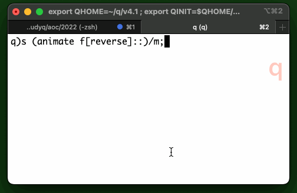

# Day 5: Supply Stacks 

> The expedition can depart as soon as the final supplies have been unloaded from the ships. Supplies are stored in stacks of marked crates, but because the needed supplies are buried under many other crates, the crates need to be rearranged.

Advent of Code 2022 [Day 5](https://adventofcode.com/2022/day/5)

## Ingestion

```q
inp: read0`:test/05.txt
```

Represent the stacks as a list of strings, top first, and the moves as a list of triples, with the stack indices using origin zero.

```q
q)`s`m set'{
  (trim@'flip x[;1+4*til(1+count first x)div 4];  /stacks
  flip 0 -1 -1+(" J J J";" ")0:y)                 /moves
  }. -1 1_'{(0,where not count each x)_ x} test
`s`m

q)s
"NZ"
"DCM"
,"P"

q)m
1 1 0
3 0 2
2 1 0
1 0 1
```

## Part 1

We want a function `f` to apply one move from the list to the state and return the new state. 
The the final state will be `s f/moves` and the answer to Part 1 will be `first each s f/moves`.

We can use Amend At to adjust the stacks in the state. 

```q
q){@[;y 2;(y[0]#s y 1),] x}[s] 1 1 0  /copy 1 from 1 to 0
"DNZ"
"DCM"
,"P"

q){@[;y 1;y[0]_] @[;y 2;(y[0]#s y 1),] x}[s] 1 1 0  /and remove copied crate
"DNZ"
"CM"
,"P"
```

We can condense the two Amend Ats with the Over accumulator.

```q
q){@/[x; y 1 2; (y[0]_;(y[0]#x y 1),)]}[s] 1 1 0
"DNZ"
"CM"
,"P"
```

Not there yet, as we see if we move two crates rather than one.

```q
q){@/[x; y 1 2; (y[0]_;(y[0]#x y 1),)]}[s] 2 1 0
"DCNZ"
,"M"
,"P"
```

Stack 0 should have been `CDNZ` had the crates been moved one a time.
We need to reverse the order of the crates being moved.

```q
q){@/[x; y 1 2; (y[0]_;(reverse y[0]#x y 1),)]}[s] 2 1 0
"CDNZ"
,"M"
,"P"
```

We have an `f`. Now we use Over to iterate it through the moves.

```q
q)f: {@/[x; y 1 2; (y[0]_;(reverse y[0]#x y 1),)]}
q)first each s f/m
"CMZ"
```

## Part 2

Part 2 requires us only to omit the `reverse`. 
We can conveniently add a function argument to `f` and project it on either `reverse` or Identity.

```q
q)f: {[o;s;m] @/[s;m 1 2;(m[0]_;(o m[0]#s m 1),)]}
q)first each s f[reverse]/m
"CMZ"
q)first each s f[::]/m
"MCD"
```

## Animation

For each move: clear the console by writing a Form Feed.
Read the console height.
Pad the stacks and set them upright; bracket each crate; write to the console with line breaks. Pause for half a second. 

```q
animate: {1 "\033[H\033[J";                     /clear console
  ht: 7h$first system"c";                       /console height
  -1 raze each ({$[null x;3#" ";"[",x,"]"]}'')
    reverse flip ht$reverse each x;
  system "sleep 0.5";                           /pause
  x }
s (animate@f[reverse]::)/m;
```



## Contributors

* András Dőtsch
* Cillian Reilly
* Stephen Taylor


