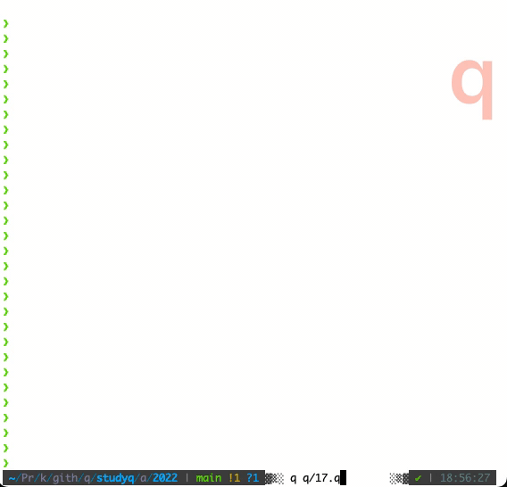

# Day 17: Pyroclastic Flow 

> Your handheld device has located an alternative exit from the cave for you and the elephants. The ground is rumbling almost continuously now, but the strange valves bought you some time. It's definitely getting warmer in here, though.
>
> The tunnels eventually open into a very tall, narrow chamber. Large, oddly-shaped rocks are falling into the chamber from above, presumably due to all the rumbling. If you can't work out where the rocks will fall next, you might be crushed!

Advent of Code 2022 [Day 17](https://adventofcode.com/2022/day/17)


## Ingestion

We can describe the five kinds of rocks as offsets from their top-left positions 

```q
ROCKS: (
  0,'til 4; 
  (0 1;1 0;1 1;1 2;2 1); 
  (0 2;1 2;2 0;2 1;2 2); 
  til[4],'0; 
  0 1 cross 0 1 )
```

and map the jets to (potential) movements left or right.

```q
q)ROCKS
(0 0;0 1;0 2;0 3)
(0 1;1 0;1 1;1 2;2 1)
(0 2;1 2;2 0;2 1;2 2)
(0 0;1 0;2 0;3 0)
(0 0;0 1;1 0;1 1)

q)show JETS: -1 1 "<>"?first read0`:test/17.txt 
1 1 1 -1 -1 1 -1 1 1 -1 -1 -1 1 1 -1 1 1 1 -1 -1 -1 1 1 1 -1 -1 -1 1 -1 -1 -1..
```

## State

A dictionary describes the state of the chamber at any time.

```q
is: `stack`posn`nr`nj`dr!(4 7#0b;0 2;0;0;0)                     /initial state
```

The rock coordinates in state `s`:

```q
q)rc: {[s] s[`posn]+/:ROCKS s[`nr]mod 5}                        /  rock coords
q)rc is
q)rc is
0 2
0 3
0 4
0 5
```

It will help to visualise it.

```q
viz: {[s]                                                      /visualise state
  ,[;1 9#"+-+"where 1 7 1] 1 rotate'"||",/:
    ./[;rc s;:;"@"] ".#"@s`stack }
```

```q
q)viz is
"|..@@@@.|"
"|.......|"
"|.......|"
"|.......|"
"+-------+"
```

## Step function

Our solution is to examine a final state `s`:

```q
s: {x[`nr]<2022}step/is
```

Each step begins with a puff from a gas jet, which might or might not change the rock position. 

The rock will then fall down one unit if possible; otherwise fuse in place where it is. 

```q
step: {[s]                                                     /state
  xy: rc s: puff s;                                            /  jet puff
  $[overlap[xy+\:1 0;s`stack];                                 /  blocked?
    new @[s;`stack;:;] ./[;xy;1b|] s`stack;                    /  fuse in place; next rock
    @[s;`posn;1 0+] ] }                                        /  fall
```

For this we need three further functions: `puff` for the effect of the next gas jet; `overlap` to determine whether any of a list of coordinates is occupied; and `new` to start the next rock falling.

The chamber needs a floor.

```q
q)is[`stack],1 7#1b
0000000b
0000000b
0000000b
0000000b
1111111b

q)(is[`stack],1 7#1b) ./: xy
0000b

q)overlap: {[xy;stack] any(stack,1 7#1b)./:xy}
```

With `overlap`, we can write `puff`.

```q
q)JETS
1 1 1 -1 -1 1 -1 1 1 -1 -1 -1 1 1 -1 1 1 1 -1 -1 -1 1 1 1 -1 -1 -1 1 -1 -1 -1..
q)0,JETS is[`nj]mod count JETS  /next jet movement
0 1

q)rc[is]+\:0 1  /new rock coordinates
0 3
0 4
0 5
0 6
```

The movement will happen if the new rock coordinates are all within the walls and do not overlap rocks in the stack.

```q
puff: {[s]                                                     /state
  j: 0,JETS s[`nj]mod count JETS;                              /  next jet
  c: rc[s]+\:j;                                                /  new coords
  s[`posn]+: j*(all c[;1]within 0 6)and not overlap[c]s`stack; /  move sideways?
  @[s;`nj;1+] }                                                /  # jets
```

It remains only to introduce the next rock. In `step`, the previous rock has already been fused in place with ``./[;xy;1b|] s`stack``. There are four other things to do:

1.  Drop from the bottom of the stack all rows that can no longer be reached
1.  Add enough empty rows to the top of the stack to accommmodate the next rock
1.  Increment the rock number
1.  Position the next rock 

The rocks have different heights. Before the next rock drops we must ensure enough empty rows at the top of the stack to accommodate it. 

```q
q)top: sum not any flip::                                      /# empty rows
q)top is`stack
4i
```

When a fallen rock blocks the last path to rows beneath it, we no longer need those rows and can drop them from the stack, provided that we keep count of the number of rows dropped. 

```q
new: {[s]                                                      /state
  s[`nr]+:1;                                                   /  next rock
  rh: 1+ max ROCKS[s[`nr]mod 5;;0];                            /  rock height 
  nnr: 0|rh+3-top s`stack;                                     /  # new rows
  s: @[s;`stack;] $[nnr;,[(nnr,7)#0b;];::];                    /  lengthen stack?
  s: @[s;`posn;:;] (top[s`stack]-rh+3),2;                      /  posn rock
  dr: count[s`stack]-max flip[s`stack]?'1b;                    /  # rows to drop
  @/[s;`stack`dr;] (neg[dr]_;dr+) }
```

Above, the expression that lengthens the stack could have been written as

```q
if[nnr;s[`stack]:((nnr,7)#0b),s`stack];
```

but [Amend At](https://code.kx.com/q/ref/amend) is preferred as functional. 
If the `if` control structure cannot be avoided entirely, it is best reserved to side effects.

The last line could have been written instead

```q
s[`stack]: neg[dr]_s`stack;
s[`dr]+: dr;
s
```

but the single expression updates stack and counter together – and qbists anyway tend to prefer terse forms. 

## Animation

A simple function animates the visualisation.

```q
animate: {[s]                                                 /state
  1 "\033[H\033[J";                                           /  clear console
  p: first[system"c"]-count v: viz s;                         /  # pad rows
  vp: $[p; (p,9)#"|.......|"; ()];                            /  vertical padding
  -1 vp,v;
  system "sleep 0.5";                                         /  pause
  s }

100 (animate step::)/is;                                      / 100 steps
```




## Part 2

With the demand for a trillion iterations in Part 2, the strategy of modelling the fall of each rock… falls apart. 

We can see that eventually the falls repeat and their results could be looked up in a cache; and that the cache keys would be 

* the rock number
* an index into the sequence of jets 
* some representation of the top of the stack

---

The only solution to Part 2 to appear was from Péter Györök.
So we reproduce his [explanation](https://github.com/gyorokpeter/puzzle_solutions/blob/master/aoc/2022/day17.md) here in full.
The complete code is in [`q/17.q`](./q/17.q) in this folder. 

# Breakdown
Example input:
```q
x:"\n"vs">>><<><>><<<>><>>><<<>>><<<><<<>><>><<>>";
```

## Common
We hardcode the rock shapes and their sizes:
```q
.d17.shape:{raze til[count x],/:'where each x}each not null
    (enlist"####";(" # ";"###";" # ");("  #";"  #";"###");
    enlist each"####";("##";"##"));
.d17.ssz:1+max each .d17.shape;
```
We transform the directions into -1/1 instead of the arrows:
```q
dir:-1+2*">"=first x;
```
We initialize a couple of variables: a cache of the direction count; the field (which starts empty); the direction index `i`; the number of pieces dropped; the top of the current piece (starting from 0 when the piece is dropped):
```q
dc:count dir;
field:();
i:-1;
pcs:0;
top:0N;
```
Furthermore we keep a field log which stores what the top of the field looked like when we dropped each piece:
```q
flog:enlist[()]!enlist `int$();
```
And we also keep the log of the field height on every piece drop:
```q
hlog:`int$();
```
The main loop will run without a terminating condition, there will be a return in the middle:
```q
while[1b;
```
We pull the next direction:
```q
i+:1;
d:dir[i mod dc];
```
We drop a piece if necessary - we indicate this by having null in the `top` variable:
```q
if[null top;
```
We drop any empty lines from the top of the field:
```q
m:0; while[$[m=count field;0b;0=sum field m]; m+:1];
field:m _field;
```
If we exceeded the piece limit (we only will for part 1), we return the current field height:
```q
if[pcs>=lim; :count[field]];
```
Otherwise, we log the field snapshot (the first 12 lines) and the height:
```q
hlog,:count field;
snap:0b,raze 12 sublist field;
flog[snap],:pcs;
```
The terminating condition for part 2 is when we find a cycle in the snapshot pattern. So first we check if the current snapshot has 3 indices already:
```q
if[3<=count st:flog[snap];
```
We also check if the differences between the elements is the same, which indicates that indeed we found a cycle:
```q
if[1=count pers:distinct 1_deltas st;
```
We then calculate the total height as indicated by the comments below:
```q
per:first pers;
hfst:hlog[st 0];    //height in first partial period
hper:hlog[st 2]-hlog[st 1]; //height per period
fullPers:(lim-st 0)div per; //number of full periods
plst:(lim-st 0)mod per;  //pieces in last partial period
hlst:hlog[plst+st 1]-hlog[st 1]; //height in last partial period
:hfst+(fullPers*hper)+hlst;
```
If we haven't found a cycle, we go ahead and fetch the next piece to drop:
```
];
];
shape:.d17.shape pcs mod 5;
ssz:.d17.ssz pcs mod 5;
```
We expand the field on top to make room for the piece, initialize the top/left coordinates of the piece and add one to the piece counter:
```q
field:((ssz[0]+3)#enlist 7#0b),field;
top:0;
left:2;
pcs+:1;
```
After dropping a piece if necessary, we can move on to actually moving the piece. First we update the left coordinate:
```q
];
left+:d;
```
If this move would cause the piece to go out of bounds, we push the piece inwards:
```q
if[7<left+ssz 1; left-:1];
if[0>left; left+:1];
```
If the piece would overlap an already existing piece, we reverse the move:
```q
if[any field ./:(top;left)+/:shape; left-:d];
```
Next we increase the top coordinate, and initialize such that we haven't encountered a hit:
```q
top+:1;
hit:0b;
```
If we hit the bottom of the field, we register a hit:
```
if[count[field]<top+ssz 0; hit:1b];
```
If we overlap with a previous piece, we also register a hit:
```q
if[any field ./:(top;left)+/:shape; hit:1b];
```
If we registered a hit, we undo the vertical move:
```q
if[hit;
top-:1;
```
We also "imprint" the piece in the field and set the top to null to indicate that a new piece needs to be dropped.
```q
field:.[;;:;1b]/[field;(top;left)+/:shape];
top:0N;
```
This is the end of the main loop.

The same solution works for part 1 and part 2. It will exit when either the given piece limit expires or we find a cycle in the pattern in the top of the field which allows us to calculate the final height. Note that for the top 12 rows, we don’t take into account which piece and movement is coming next; also pieces may fall more than 12 lines, but this still proved a good enough heuristic.

## Contributors

* Péter Györök
* Stephen Taylor