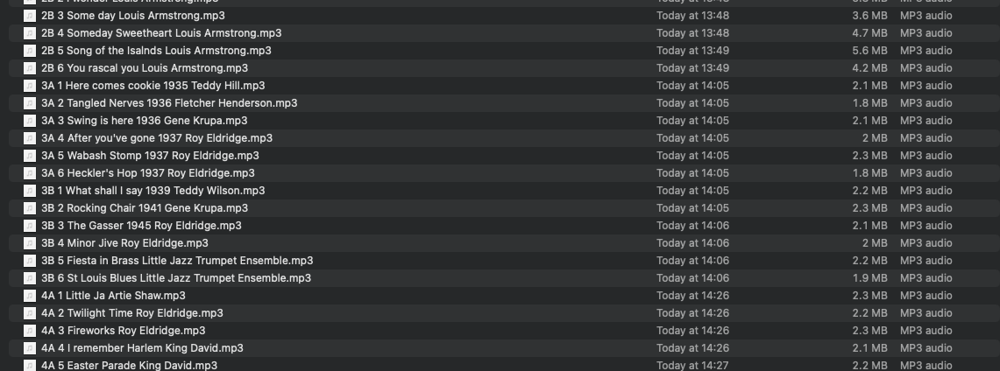
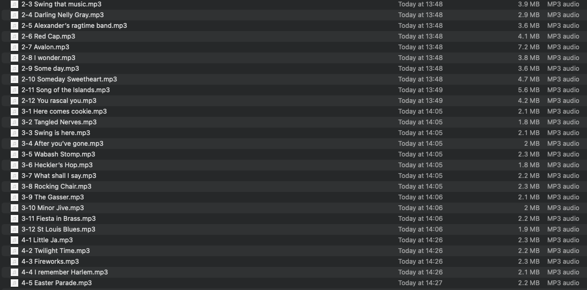

# All that jazz

## *The librarian’s song*

*This article, and the accompanying code, is [on GitHub](https://github.com/StephenTaylor-Kx/jazz.q).*


I wonder sometimes about my partner’s father. The first time we met he launched into a lively discussion of audio recording media: magnetic tape, vinyl and Bakelite discs. I did my best to keep up. But we manage to get along. I sent him a wax cylinder for an Edison phonograph I’d found in a store in a small Texas town. And he sent me 736 WAV files from sixty five LPs of jazz classics. A feast for my Apple Music library. 
But Apple Music needs a little help identifying artists and song names.

```txt
❯ ls /Volumes/Terry/downloads/wavs
10A 1 Tea for two Fats Waller.wav
10A 2 Carolina shout Fats Waller.wav
10A 3 I've got my love to keep me warm.wav
10A 4 Chloe.wav
10A 5 Tiger Rag.wav
10A 6 Lullaby of the leaves.wav
10B 1 Indiana.wav
10B 2 How high .wav
10B 3 Cocktails for two.wav
10B 4 Time on my hands.wav
10B 5 Lucille.wav
10B 6 Makin’ Whoopee.wav
11A 1 Weather Bird Louis Armstrong.wav
11A 2 Chimes in blue Louis Armstrong.wav
11A 3 Angry Earl Hines Orchestra.wav
...
```

WAV files don’t hold metadata, but someone had thoughtfully named the files in a predictable pattern: disc number and side, track number, track name, sometimes a year, then the artist. Like any dataset, errors needed correcting. Dizzy Gillespie was sometimes Dizy. Duke Ellington was sometimes Duke Ellington and his Orchestra. Or just Ellimgton. I’m a librarian. I put information where people can find it. My Music library needed only one Duke Ellington. 

This is the story of how I used q to hack the metadata into Apple Music. Because q is a proprietary language, most q coders know it as a language they learned in order to query large datasets. But q is a general-purpose programming language. The 32-bit interpreter is free for non-commercial use, and it’s a *great* tool for general hacking. And lots of datasets need a little hacking. 

Cleaning up a dataset, finding and fixing problems, is always exploratory, and we’ll get a taste here of just how lively and responsive the q REPL is for this work. We’ll be using qSQL queries but the work will also get us using their functional forms on a few occasions. We shall also discover some ways to prevent Apple Music overriding our metadata.

**Vector programming**
This work is also an example of functional vector programming in practice.
There is plenty of iteration in the computations but few signs of it in the code.
Many of the q primitives, and all qSQL queries, iterate implicitly. 
Where iteration needs specifying , [iteration operators](https://code.kx.com/q/ref/iterators/) are used, but even these are used sparsely.
(It is a common qbie error to use iteration operators when iteration is already implicit.)
There is no use of the `do` or `while` control words, and only a single `if` in the whole script.

Only three functions require multiple lines to define them; the longest has six. 

There is also a preference for [tacit forms](https://en.wikipedia.org/wiki/Tacit_programming) rather than lambdas or setting variables that are read immediately and never used again.


## Strategy

WAV files don’t hold metadata, so we convert them to a format that does. AIFF or Apple Lossless is my default, but it’s overkill here: MP3 suffices for these ancient recordings. Nine of the WAVs were empty or incomplete; the open-source Audacity application converted the remaining 727 WAVs to MP3s with no metadata. 

My default Music setting has the application make and keep its own copies of files it imports. For the next step I disabled that: Music would add imported files to its catalogue, but leave the source files where they are. 

I copied the MP3s to a `tmp` folder and imported them to Music. They appeared as *Unknown Album* with the track names corresponding to the source file names. I edited the album to *Classic Jazz*, set the genre to `Jazz`, flagged it as a compilation by various artists, and set the `Disc Count` to 65.
Then I added the album to a new playlist, which also took the name *Classic Jazz*, and exported the playlist as `Classic Jazz.xml`.

At this point Apple Music has already been into the MP3s, updating the metadata. We’re not having any of that, so I deleted the contents of `tmp` and replaced it with fresh, untouched copies of the MP3s, as originally converted. 

<br>
*The playlist in Apple Music with potential metadata embedded in the track names*

Now to work. 
This is what `jazz.q` does.

The XML starts with some info about the album then gets down to listing the tracks.
```xml
?xml version="1.0" encoding="UTF-8"?>
<!DOCTYPE plist PUBLIC "-//Apple Computer//DTD PLIST 1.0//EN" "http://www.apple.com/DTDs/PropertyList-1.0.dtd">
<plist version="1.0">
<dict>
	<key>Major Version</key><integer>1</integer>
	<key>Minor Version</key><integer>1</integer>
	<key>Date</key><date>2022-04-28T15:00:20Z</date>
	<key>Application Version</key><string>1.2.3.56</string>
	<key>Features</key><integer>5</integer>
	<key>Show Content Ratings</key><true/>
	<key>Music Folder</key><string>file:///Volumes/Terry/Music/Media.localized/</string>
	<key>Library Persistent ID</key><string>B87A853FC2363DE6</string>
	<key>Tracks</key>
	<dict>
		<key>9509</key>
		<dict>
			<key>Track ID</key><integer>9509</integer>
			<key>Name</key><string>10A 1 Tea for two Fats Waller</string>
			<key>Album</key><string>Classic Jazz</string>
			<key>Genre</key><string>Jazz</string>
			<key>Kind</key><string>MPEG audio file</string>
			<key>Size</key><integer>4616090</integer>
			<key>Total Time</key><integer>190981</integer>
			<key>Disc Count</key><integer>65</integer>
			<key>Date Modified</key><date>2022-04-28T14:54:53Z</date>
			<key>Date Added</key><date>2022-04-28T14:53:14Z</date>
			<key>Bit Rate</key><integer>192</integer>
			<key>Sample Rate</key><integer>44100</integer>
			<key>Normalization</key><integer>1244</integer>
			<key>Compilation</key><true/>
			<key>Persistent ID</key><string>14DCA203F16E25A1</string>
			<key>Track Type</key><string>File</string>
			<key>Location</key><string>file:///Volumes/Terry/tmp/10A%201%20Tea%20for%20two%20Fats%20Waller.mp3</string>
			<key>File Folder Count</key><integer>-1</integer>
			<key>Library Folder Count</key><integer>-1</integer>
		</dict>
...
```
Each track is represented by a key:dict pair in which the key replicates the Track ID, and the dict is a list of key:value pairs.
We select the key:dict pairs and convert them into a table. 

We work on the metadata in the table. 



From the cleaned-up metadata we derive new filenames in the format Disc Number, Track Number, Track Name and then rename the files.
(This seems to deter Apple Music from analysing the file names and overwriting the metadata.)



We adjust the Location values accordingly. 

Lastly we mark up the table as XML, top and tail it from the original XML and write `importPlaylist.xml`.
That completes `jazz.q`.

```bash
❯ pwd
/Volumes/Terry
❯ q jazz.q
KDB+ 4.1t 2022.04.15 Copyright (C) 1993-2022 Kx Systems
m64/ 12()core 65536MB sjt mackenzie.local 127.0.0.1 ..

`:importPlaylist.xml
```
Back in Apple Music we delete the *Classic Jazz* playlist and the *Classic Jazz* album.

Now we set the Preferences back to the original setting: *Copy files to Music media folder when importing*.
And we import `importPlaylist.xml`. The renamed but otherwise untouched MP3s get copied into the Apple Music files, and the metadata is read from the XML. 
```xml
<key>9509</key>
<dict>
	<key>Track ID</key><integer>9509</integer>
	<key>Album</key><string>Classic Jazz</string>
	<key>Genre</key><string>Jazz</string>
	<key>Kind</key><string>MPEG audio file</string>
	<key>Size</key><integer>4616090</integer>
	<key>Total Time</key><integer>190981</integer>
	<key>Disc Count</key><integer>65</integer>
	<key>Date Modified</key><date>2022-04-28T14:54:53Z</date>
	<key>Date Added</key><date>2022-04-28T14:53:14Z</date>
	<key>Bit Rate</key><integer>192</integer>
	<key>Sample Rate</key><integer>44100</integer>
	<key>Normalization</key><integer>1244</integer>
	<key>Compilation</key><true/>
	<key>Persistent ID</key><string>14DCA203F16E25A1</string>
	<key>Track Type</key><string>File</string>
	<key>Location</key><string>file://:/Volumes/Terry/tmp/10-1%20Tea%20for%20two.mp3</string>
	<key>File Folder Count</key><integer>-1</integer>
	<key>Library Folder Count</key><integer>-1</integer>
	<key>Disc Number</key><integer>10</integer>
	<key>Track Number</key><integer>1</integer>
	<key>Track Count</key><integer>12</integer>
	<key>Name</key><string>Tea for two</string>
	<key>Year</key><integer></integer>
	<key>Artist</key><string>Fats Waller</string>
	<key>Comments</key><string></string>
</dict>
```
That’s the strategy. Now the details.


## Ingestion

The XML playlist exported from Apple Music provides a template. 
The track information lies between the `Tracks` and `Playlists` keys, each track described by key:value pairs within a `dict` element.
We partition the key:value lines into a list `dix`. 
```q
xml:read0`$":Classic Jazz.xml"
i:(first where@)each xml like/:{"*<key>",string[x],"</key>"}each`Tracks`Playlists
tx:(2+i 0)_(-1+ i 1)#xml
dix:1_'-2_'_[;tx]where tx like"*<dict>*"  / group of k:v lines
```
```q
q)first dix
"\t\t\t<key>Track ID</key><integer>9509</integer>"
"\t\t\t<key>Name</key><string>10A 1 Tea for two Fats Waller</string>"
"\t\t\t<key>Album</key><string>Classic Jazz</string>"
"\t\t\t<key>Genre</key><string>Jazz</string>"
"\t\t\t<key>Kind</key><string>MPEG audio file</string>"
"\t\t\t<key>Size</key><integer>4616090</integer>"
"\t\t\t<key>Total Time</key><integer>190981</integer>"
"\t\t\t<key>Disc Count</key><integer>65</integer>"
"\t\t\t<key>Date Modified</key><date>2022-04-28T14:54:53Z</date>"
"\t\t\t<key>Date Added</key><date>2022-04-28T14:53:14Z</date>"
"\t\t\t<key>Bit Rate</key><integer>192</integer>"
"\t\t\t<key>Sample Rate</key><integer>44100</integer>"
"\t\t\t<key>Normalization</key><integer>1244</integer>"
"\t\t\t<key>Compilation</key><true/>"
"\t\t\t<key>Persistent ID</key><string>14DCA203F16E25A1</string>"
"\t\t\t<key>Track Type</key><string>File</string>"
"\t\t\t<key>Location</key><string>file:///Volumes/Terry/tmp/10A%201%20Tea%20f..
"\t\t\t<key>File Folder Count</key><integer>-1</integer>"
"\t\t\t<key>Library Folder Count</key><integer>-1</integer>"
```
Let’s have that as a q dictionary. 
We need a function `pl` to parse the line.
```q
q)pl:{@[;1 3] _[;x]where differ .[|]1 prev\(<>\)x in "<>"} except[;"\t"]@  / parse line
q)dix[0;0]
"\t\t\t<key>Track ID</key><integer>9509</integer>"
q)pl dix[0;0]
"Track ID"
"9509"
```
General parsing of XML is not trivial, but here nothing is nested, we just need to extract the element contents.
For this we can use an ancient vector-programming idiom, Not Equal Scan. On a boolean vector this flips state every time the scan hits a flag.
```q
q)(<>\) 0000010000010000010000010000b
0000011111100000011111100000b
q)show q:dix[0;0] except"\t"
"<key>Track ID</key><integer>9509</integer>"
q)q in "<>"
100010000000010000110000000100001000000001b
q)(<>)scan q in "<>"
111100000000011111011111111000001111111110b
q)(q;)(<>)scan q in "<>"
< k e y > T r a c k   I D < / k e y > < i n t e g e r > 9 5 0 9 < / i n t e g..
1 1 1 1 0 0 0 0 0 0 0 0 0 1 1 1 1 1 0 1 1 1 1 1 1 1 1 0 0 0 0 0 1 1 1 1 1 1 1..
```
In the last expression we used `(q;)` to align the boolean with the characters in `q`. 
(See [“Missing some items”](https://community.kx.com/t5/New-kdb-q-users-question-forum/Missing-some-items/m-p/12376#M408) for how lists with missing items work.)
We haven’t quite masked out the XML tags but we can do so with OR and the `prev` of the boolean.
```q
q)(q;).[or]1 prev\(<>)scan q in "<>"
< k e y > T r a c k   I D < / k e y > < i n t e g e r > 9 5 0 9 < / i n t e g..
1 1 1 1 1 0 0 0 0 0 0 0 0 1 1 1 1 1 1 1 1 1 1 1 1 1 1 1 0 0 0 0 1 1 1 1 1 1 1..
```
Note the use of `1 prev\` to return both the boolean and the `prev` of the boolean.
This is an example of the [Zen monks](https://community.kx.com/t5/Community-Blogs/Meet-the-Zen-monks/ba-p/11604) idiom, a [tacit](https://en.wikipedia.org/wiki/Tacit_programming) expression.
Instead of `1 prev` one could write e.g. `{(x;prev x)}` or `(a;)prev a:`. 
The tacit form allows us to avoid setting a variable never subsequently read or the tiny overhead of a lambda.
It remains only to use the mask to partition the line, and extract the second and fourth items.
```q
pl:{@[;1 3] _[;x]where differ (or). 1 prev\(<>)scan x in "<>"} except[;"\t"]@  / parse line
```
Note above that `pl` is defined as a lambda composed with a unary projection of `except`.
That should be easier to read than nested lambdas.
```q
{{@[;1 3] _[;x]where differ (or) . 1 prev\(<>)scan x in "<>"}x except"\t"}  / parse line
```
Now we can derive a list of dictionaries from `dix`.
```q
q)dd:{(!).(`$;::)@'flip pl each x}each dix  / list of dictionaries
```
Above, `flip pl each` returns each XML dictionary as a list of key strings and a list of value strings, and ``(`$;::)@'`` casts the former only to symbols. 
Once again, note how the tacit form does it without a lambda or setting a variable.
Finally [Dict](https://code.kx.com/q/ref/dict) [Apply](https://code.kx.com/q/ref/apply) returns the two lists as a dictionary.
A table is a list of dictionaries, so is `dd` now a table?
```q
q)dd
Track ID Name                                                     Album      ..
-----------------------------------------------------------------------------..
"9509"   "10A 1 Tea for two Fats Waller"                          "Classic Ja..
"9514"   "10A 2 Carolina shout Fats Waller"                       "Classic Ja..
"9517"   "10A 3 I've got my love to keep me warm"                 "Classic Ja..
"9520"   "10A 4 Chloe"                                            "Classic Ja..
"9523"   "10A 5 Tiger Rag"                                        "Classic Ja..
"9526"   "10A 6 Lullaby of the leaves"                            "Classic Ja..
"9529"   "10B 1 Indiana"                                          "Classic Ja..
"9532"   "10B 2 How high "                                        "Classic Ja..
"9535"   "10B 3 Cocktails for two"                                "Classic Ja..
"9538"   "10B 4 Time on my hands"                                 "Classic Ja..
"9541"   "10B 5 Lucille"                                          "Classic Ja..
"9544"   "10B 6 Makin\342\200\231 Whoopee"                        "Classic Ja..
"9547"   "11A 1 Weather Bird Louis Armstrong"                     "Classic Ja..
"9550"   "11A 2 Chimes in blue Louis Armstrong"                   "Classic Ja..
"9553"   "11A 3 Angry Earl Hines Orchestra"                       "Classic Ja..
"9556"   "11A 4 Rhythm Sunday Hines"                              "Classic Ja..
"9559"   "11A 5 The Earl Hines Orchestra"                         "Classic Ja..
"9562"   "11B 1 Curry in a hurry Charlie Shavers Quintet"         "Classic Ja..
"9565"   "11B 2 Rosetta Earl Hines Trio"                          "Classic Ja..
"9568"   "11B 3 Fine and Dandy Louis Armstrong and the All Stars" "Classic Ja..
..
```
Looks like it.
```q
q)type dd
0h
```
Sadly not. A table is a list of dictionaries of *like keys*; that is, the dictionary keys must [Match](https://code.kx.com/q/ref/match). 
And ours don’t. 
Happily the remedy is easy. 
We use the union of their keys to make a ‘template’ dictionary, into which we [`upsert`](https://code.kx.com/q/ref/upsert) each dictionary.
The resulting list of dictionaries will have like keys and will therefore be a table.
```q
q)tmpl:{x!count[x]#enlist""} (union) over key each dd  / template
q)type t:tmpl upsert/:dd  / table
98h
```


## Disc and track numbers

We now have the XML track metadata as a q table, and get down to parsing it.
The disc numbers are easy targets, from which we want to separate the sides, which have no place in the final result, but which we will need to calculate track numbers.
We can also remove disc and track information from the `Name` column.
```q
/ PARSING
update disc:{(x?" ")#x}each Name from `t;
update side:`$'last each disc from `t;
update disc:"H"$'-1_'disc from `t;
update track:{"H"$@[;1]" "vs x}each Name from `t;
update Name:{_[;x]1+@[;1]where null x}each Name from `t;  / remove disc, side, track
```
Above, the qSQL queries in our q script are terminated with semicolons to prevent their results (in each case the symbol `` `t``) being displayed in the session log.

Apple’s Music library is designed for CDs rather than LPs – it has no interest in sides. 
We need to add to the track numbers for B sides the number of tracks on the A side of the same disc.
```q
/ # of tracks on each disc
t:t lj select ntrack:count i by disc from `t
/ # of tracks on A side of disc
t:t lj select atrack:count i by disc from `t where side=`A
/ absolute track # on disc
update track:track+(side=`B)*atrack from `t;
```


## Artist names

Now things get squirrely. 
Artist names come in various forms and include spelling errors. 
‘Duke’ Ellington is sometimes *Duke Ellington Orchestra* and sometimes *Ellimgton*.
With a smaller dataset I would probably clean all this up after import; doing what you do to have a well-catalogued Music library: edit, edit, edit. 
But I will probably run my script many times before I have found and fixed everything to my satisfaction.
It’s worth getting the script to fix the artists’ names.

I write the `Name` column to a text file and attack it with a text editor, erasing the song names to leave only the artists. 
I have the lines sorted into alphabetical order and remove duplicates.
Now for variants. Some are spelling errors that simply need correcting. 

But some are legitimate variants.
For example, I want *Benny Carter and his Swing Quartet* and *Benny Carter Orchestra* both listed as *Benny Carter*, but I’m a librarian – I do not destroy valid information. So I want valid variants preserved in the `Comments` column, which is so far empty.

So my `artists.txt` file has entries like this:
```txt
Earl Hines|Hines#Earl Hines Orchestra|The Earl Hines Orchestra|Earl Hines Trio
Earl Hines & Budd Johnson|Earl Hines Budd Johnson
Eddie Condon
```
In the first line `Earl Hines` is the ’canonical’ name, and `Hines` is treated as a misspelling. But the list following the hash symbol are variants to be preserved in the `Comments` field.
Similarly, `Earl Hines Budd Johnson` is to be replaced by `Earl Hines & Budd Johnson`, and `Eddie Condon` has no variants, valid or otherwise.

A function `pa` parses each such line into a table: keys to look for in the `Name` column, corresponding values for the `Artist` column, and strings for the `Comments` column.
We parse the lines of `artists.txt` and sort the resulting table by key length to ensure the longest matches are found first.
```q
pa:{ / parse artist
  q:"|"vs'2#("#"vs x),enlist"";
  k:raze q;  / keys
  v:count[k]#enlist first first q;  / canonical name
  n:neg[count k]#(count[k]#enlist""),q 1;  / Comments
  flip`key`val`Comments!(k;v;n)@\:where 0<count each k}
/ longest keys first
arts:{x idesc count each x`key}raze pa each read0`:artists.txt
```
```q
q)arts
key                                              val                         ..
-----------------------------------------------------------------------------..
"Bobby Hackett, Jack Teagarden & Peewee Russell" "Bobby Hackett, Jack Teagard..
"Sidney Bechet-Albert Nicholas Blue Five"        "Sidney Bechet-Albert Nichol..
"Clifford Don Byas-Bud Powell All Stars"         "Clifford Don Byas-Bud Powel..
"Jelly Roll Morton New Orleans Jazz Men"         "Jelly Roll Morton"         ..
"Jelly Roll Morton and Red Hot Peppers"          "Jelly Roll Morton"         ..
"Jelly Roll Morton and his Orchestra"            "Jelly Roll Morton"         ..
"Jelly Roll Morton's Red Hot Peppers"            "Jelly Roll Morton"         ..
"Lester Young with the Nat Cole Trio"            "Lester Young"              ..
"Coleman Hawkins and Thelonius Monk"             "Coleman Hawkins and Theloni..
"Dizzy Gillespie and Duke Ellington"             "Dizzy Gillespie and Duke El..
"Coleman Hawkins and Duke Ellington"             "Coleman Hawkins and Duke El..
"Johnny Dodds Black Bottom Stompers"             "Johnny Dodds"              ..
"Coleman Hawkins All Star Jam Band"              "Coleman Hawkins"           ..
"King Oliver and Jelly Roll Morton"              "King Oliver and Jelly Roll ..
"Lester Young Cole Buddy Rich Trio"              "Lester Young"              ..
"Louis Armstrong and the All Stars"              "Louis Armstrong"           ..
"Sidney Bechet and his Feetwarmers"              "Sidney Bechet"             ..
"Bechet-Albert Nicholas Blue Five"               "Sidney Bechet-Albert Nichol..
..
```
Some `Name` strings include a recording date between the song and artist names, which we want to capture in the `Year` column.
After the artist’s name has been removed, function `pny` checks to see if the last word in the string is a date.
```q
pny:{lw:last w:" "vs x; $[all lw within"09";(" "sv -1_w;lw);(x;"")]}  / parse song name and year
```
Now we are ready to parse the `Name` strings.
```q
pns:{[a;s] / parse Name string
  i:where 0<count each ii:s ss/:a`key;  / find artist?
  $[count i; (pny trim s til first ii i 0),a[i 0]`val`Comments; (s;"";"";"")] }[arts;]
update syan:pns each Name from `t;  / song; year; artist; Comments
update song:syan[;0],Year:syan[;1],Artist:syan[;2],Comments:syan[;3] from `t;
```


## Miscellaneous

There’s always something. 
Here we also want to 

* replace typewriter quotes with typographer’s quotes 
* correct some spelling errors
* supply a default song name where the filename has none

Spelling corrections are in `typos.csv`:
```txt
Balck,Black
Rendesvous,Rendezvous
Waltsing,Waltzing
Cadis,Cadiz
a la,à la
Isalnds,Islands
Lasy,Lazy
```

```q
/ MISCELLANEOUS
update song:ssr[;"'";"’"] each song from `t;  / typographer's quotes
/ spelling corrections
typos:("**";csv)0:`:typos.csv  
update song:ssr/[;typos 0;typos 1] each song from `t;
/ default track names
q:not count each t`song;
update song:sum[q]#enlist"(unknown)" from `t where q;
```


## Rename the source files

Apple Music has its own ways of analysing file names for metadata. We need to put a stop to that.
We shall rename the files. The song names alone won’t do; some songs are covered by several artists. 
But prefixing the song name with disc and track number will do it.

We start by reversing the URL escaping already in the file names.
In `newfp` below, notice the use of [`sv`](https://code.kx.com/q/ref/sv/) and [`vs`](https://code.kx.com/q/ref/vs/) to join and separate parts of the file path.
```q
update oldfilepath:.h.uh each 7_' Location from `t;
newfp:{ / new filepath
  new:("-"sv string x`disc`track)," ",x`song;
  fpn:` vs hsym`$7_ .h.uh x`Location;  / filepath; name
  ext:@[;1]"." vs string fpn 1;  / file extension
  1_ string` sv fpn[0],`$"."sv(new;ext) } 
update newfilepath:newfp each t from `t;
```
Now we have the new filenames we can rename the source files.
Notice below how ``t`oldfilepath`newfilepath`` gives two lists; the Each iterator `'` is applied to the binary lambda and the derived function `{...}'` applied to the pair of lists.

Operations on the filesystem may be interrupted by errors then resumed. 
So the rename is guarded by a test to confirm the source file exists.
For this, notice another use of the Zen monks idiom (`1 key\`) with Match Apply for a tacit test that the file exists.
```q
/ rename files
/ `:tmp.txt 0:t[`oldfilepath]{"mv '",x,"' '",y,"'"}'t`newfilepath
DQ:"\"" / double quote
{if[(~). 1 key\hsym`$x;system"mv ",DQ,x,DQ," ",DQ,y,DQ]}' . t`oldfilepath`newfilepath;
update Location:{"file://:","/"sv{@[x;count[x]-1;.h.hu]}"/"vs x}each newfilepath from `t;
```
All the metadata we need is now in table `t`, but there is also much we do not need and some columns need renaming.
We make a new table `u` in which everything is ready for marking up.

For example, we want to replace the (empty) content of column `Disc Number` with the content of `disc`.
We cannot conveniently write qSQL queries with columns whose names are not valid q names, so we shall remove some columns and rename some others.

We use the [functional form of Select](https://code.kx.com/q/basics/funsql/#select) to select a computed list of column names.
First, we need a dictionary `ctrn` of  columns to rename.
```q
/ PREPARE OUTPUT
/ rename columns
ctrn:`disc`track`ntrack`song!`$("Disc Number";"Track Number";"Track Count";"Name")  / cols to rename
u:?[t;();0b;{x!x}cols[t]except`syan`atrack`side`newfilepath`oldfilepath,value ctrn]
u:@[cols u;cols[u]?key ctrn;:;value ctrn] xcol u
```
Our functional Select is quite simple. 
Recall that the functional form of `select from t` is `?[t;();0b;()]`.
All we have to do is to replace the fourth argument (the general empty list `()`) with a dictionary `{x!x}` of the column names we want.
It remains only to rename the columns specified in `ctrn` and apply XML escaping to the Artist, Name, and Comments.
```q
/ XML escaping
update Artist:.h.xs each Artist, Name:.h.xs each Name, Comments:.h.xs each Comments from `u
```


## Mark up the table as XML

Reviewing the original XML we see each value is marked up in an element that specifies its type.
All that is, except `Compilation`, a boolean flag that is here always true and marked up `<true/>`.
A short CSV `datatypes.csv` suffices to map columns to the XML datatypes.
```csv
Track ID,integer
Album,string
Genre,string
Kind,string
Size,integer
Total Time,integer
Disc Count,integer
Date Modified,date
Date Added,date
Bit Rate,integer
Sample Rate,integer
Normalization,integer
Compilation,boolean
Persistent ID,string
...
```
With this as dictionary `DT` we can write function `mukv` to mark up a key:value pair and with that, function `mut` to mark up a track. 
It remains only to iterate `mut` over the tracks, raze the result, and top and tail it with lines from the original XML. 
```q
/ MARK UP AS XML
/ XML data types
DT:.[!]("SS";csv)0:`:datatypes.csv
/ mark up value y from column x
mukv:{typ:DT x;"\t",.h.htc[`key;string x],$[typ=`boolean;"<true/>";.h.htc[typ]$[10h=type y;y;string y]]}
/ mark up track
mut:{"\t",'(.h.htc[`key;x`$"Track ID"];"<dict>"),(key[x]mukv'value x),enlist"</dict>"}
`:importPlaylist.xml 0:((2+i 0)#xml),("\t",'raze mut each u),(-1+i 1) _ xml
```
Note above that by prefixing lines with atom `"\t"` at judiciously chosen points we replicate the ‘pretty print’ indentation of the original. Not necessary, but makes errors much easier to spot.

The metadata is ready for Apple Music to import. 
```xml
<?xml version="1.0" encoding="UTF-8"?>
<!DOCTYPE plist PUBLIC "-//Apple Computer//DTD PLIST 1.0//EN" "http://www.apple.com/DTDs/PropertyList-1.0.dtd">
<plist version="1.0">
<dict>
	<key>Major Version</key><integer>1</integer>
	<key>Minor Version</key><integer>1</integer>
	<key>Date</key><date>2022-04-28T15:00:20Z</date>
	<key>Application Version</key><string>1.2.3.56</string>
	<key>Features</key><integer>5</integer>
	<key>Show Content Ratings</key><true/>
	<key>Music Folder</key><string>file:///Volumes/Terry/Music/Media.localized/</string>
	<key>Library Persistent ID</key><string>B87A853FC2363DE6</string>
	<key>Tracks</key>
	<dict>
		<key>9509</key>
		<dict>
			<key>Track ID</key><integer>9509</integer>
			<key>Album</key><string>Classic Jazz</string>
			<key>Genre</key><string>Jazz</string>
			<key>Kind</key><string>MPEG audio file</string>
			<key>Size</key><integer>4616090</integer>
			<key>Total Time</key><integer>190981</integer>
			<key>Disc Count</key><integer>65</integer>
			<key>Date Modified</key><date>2022-04-28T14:54:53Z</date>
			<key>Date Added</key><date>2022-04-28T14:53:14Z</date>
			<key>Bit Rate</key><integer>192</integer>
			<key>Sample Rate</key><integer>44100</integer>
			<key>Normalization</key><integer>1244</integer>
			<key>Compilation</key><true/>
			<key>Persistent ID</key><string>14DCA203F16E25A1</string>
			<key>Track Type</key><string>File</string>
			<key>Location</key><string>file://:/Volumes/Terry/tmp/10-1%20Tea%20for%20two.mp3</string>
			<key>File Folder Count</key><integer>-1</integer>
			<key>Library Folder Count</key><integer>-1</integer>
			<key>Disc Number</key><integer>10</integer>
			<key>Track Number</key><integer>1</integer>
			<key>Track Count</key><integer>12</integer>
			<key>Name</key><string>Tea for two</string>
			<key>Year</key><integer></integer>
			<key>Artist</key><string>Fats Waller</string>
			<key>Comments</key><string></string>
		</dict>
...
```


## Conclusion

Cleaning up data is a process of discovery. As obvious errors are removed, subtler ones become apparent. 
Being able to hack the data in the q REPL tightens the feedback loop and speeds the whole process along.

It also helps that so many of the fixes can be defined with single-line expressions.
Most of the single-line functions above were built up in the REPL before being pasted in to the q script. 
Again, the feedback loop for finding and fixing problems is very tight, maintaining precious ‘flow’.

If your work with datasets requires you from time to time to clean up data, you might find nimble, agile q a helpful tool for the job.


## `jazz.q`

```q
/ INGESTION
xml:read0`$":Classic Jazz.xml"
i:(first where@)each xml like/:{"*<key>",string[x],"</key>"}each`Tracks`Playlists
tx:(2+i 0)_(-1+ i 1)#xml
dix:1_'-2_'_[;tx]where tx like"*<dict>*"  / group of k:v lines
pl:{@[;1 3] _[;x]where differ (or). 1 prev\(<>)scan x in "<>"} except[;"\t"]@  / parse line
dd:{.[!](`$;::)@'flip pl each x}each dix  / list of dictionaries
tmpl:{x!count[x]#enlist""}(union) over key each dd  / template
t:tmpl upsert/:dd  / table

/ PARSING
update disc:{(x?" ")#x}each Name from `t;
update side:`$'last each disc from `t;
update disc:"H"$'-1_'disc from `t;
update track:{"H"$@[;1]" "vs x}each Name from `t;
update Name:{_[;x]1+@[;1]where null x}each Name from `t;  / remove disc, side, track
/ # of tracks on each disc
t:t lj select ntrack:count i by disc from `t
/ # of tracks on A side of disc
t:t lj select atrack:count i by disc from `t where side=`A
/ absolute track # on disc
update track:track+(side=`B)*atrack from `t;

/ IDENTIFY ARTISTS
pa:{ / parse artist
  q:"|"vs'2#("#"vs x),enlist"";
  k:raze q;  / keys
  v:count[k]#enlist first first q;  / canonical name
  n:neg[count k]#(count[k]#enlist""),q 1;  / Comments
  flip`key`val`Comments!(k;v;n)@\:where 0<count each k}
/ longest keys first
arts:{x idesc count each x`key}raze pa each read0`:artists.txt

pns:{[a;s] / parse Name string
  i:where 0<count each ii:s ss/:a`key;  / find artist?
  $[count i; (pny trim s til first ii i 0),a[i 0]`val`Comments; (s;"";"";"")] }[arts;]
pny:{lw:last w:" "vs x; $[all lw within"09";(" "sv -1_w;lw);(x;"")]}  / parse song name and year
update syan:pns each Name from `t;  / song; year; artist; Comments
update song:syan[;0],Year:syan[;1],Artist:syan[;2],Comments:syan[;3] from `t;

/ MISCELLANEOUS
update song:ssr[;"'";"’"] each song from `t;  / typographer's quotes
/ spelling corrections
typos:("**";csv)0:`:typos.csv  
update song:ssr/[;typos 0;typos 1] each song from `t;
/ default track names
q:not count each t`song;
update song:sum[q]#enlist"(unknown)" from `t where q;

/ rename files to stop Apple Music renaming the songs
update oldfilepath:.h.uh each 7_' Location from `t;
newfp:{ / new filepath
  new:("-"sv string x`disc`track)," ",x`song;
  fpn:` vs hsym`$7_ .h.uh x`Location;  / filepath; name
  ext:@[;1]"." vs string fpn 1;  / file extension
  1_ string` sv fpn[0],`$"."sv(new;ext) } 
update newfilepath:newfp each t from `t;
/ rename files
/ `:tmp.txt 0:t[`oldfilepath]{"mv '",x,"' '",y,"'"}'t`newfilepath
DQ:"\"" / double quote
{if[(~). 1 key\hsym`$x;system"mv ",DQ,x,DQ," ",DQ,y,DQ]}' . t`oldfilepath`newfilepath;
update Location:{"file://:","/"sv{@[x;count[x]-1;.h.hu]}"/"vs x}each newfilepath from `t;

/ PREPARE OUTPUT
/ rename columns
ctrn:`disc`track`ntrack`song!`$("Disc Number";"Track Number";"Track Count";"Name")  / cols to rename
u:?[t;();0b;{x!x}cols[t]except`syan`atrack`side`newfilepath`oldfilepath,value ctrn]
u:@[cols u;cols[u]?key ctrn;:;value ctrn] xcol u
/ XML escaping
update Artist:.h.xs each Artist, Name:.h.xs each Name, Comments:.h.xs each Comments from `u

/ MARK UP AS XML
/ XML data types
DT:.[!]("SS";csv)0:`:datatypes.csv
/ mark up value y from column x
mukv:{typ:DT x;"\t",.h.htc[`key;string x],$[typ=`boolean;"<true/>";.h.htc[typ]$[10h=type y;y;string y]]}
/ mark up track
mut:{"\t",'(.h.htc[`key;x`$"Track ID"];"<dict>"),(key[x]mukv'value x),enlist"</dict>"}
`:importPlaylist.xml 0:((2+i 0)#xml),("\t",'raze mut each u),(-1+i 1) _ xml
```


*[REPL]: Read, Evaluate, Print loop