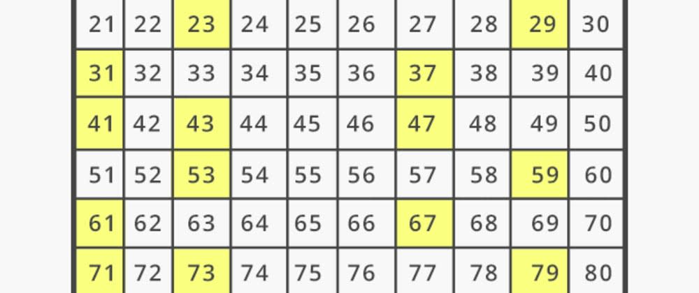

# Finding primes with q

with [Noah Attrup](mailto:nattrup@kx.com)

## Part 1: functional solutions



Finding prime numbers is a compute-intensive task familiar to computer-science students.
It is typically tackled with tightly-iterating algorithms in a language close to the hardware, such as C.

It might appear an unrewarding topic for a vector-programming language.
We explore it here to study efficient vector solutions in a well-understood problem domain.
We are interested not so much in the solutions themselves, but in the *process of developing them*, which we illustrate.

The q language handles large data tables efficiently, and supports coders familiar with SQL. 
It is easy to overlook the vector handling on which its power is based, and the direct access to it that the language affords.
We hope our account will be of value to q developers who want to deepen their vector-programming skills. 

Part 1 of this article examines functional solutions to two familiar questions:

-   Is _x_ prime?
-   What are the primes up to and including _N_?

Subsequent parts will explore prime factorization and stateful solutions.


## Background

It is sometimes said that in programming languages derived from Iverson’s notation (e.g. APL, J, k, q) “iteration is free”. Operators and built-in functions iterate implicitly through arrays. They are supplemented by higher-order operators that specify more elaborate iteration patterns such as Converge, Map-reduce and Fold.  This has three important, but quite different consequences.

-   The writer is relieved of the work of writing loops and can specify common patterns of iteration with one or two symbols. With iteration as subordinated detail the remaining parts of an algorithm are easier to study.
-   Vectors correspond to machine architectures. Algorithms expressed in vectors are more tractable for parallelization. Higher levels of abstraction leave implementors more scope for optimization. 
-   Condensing an algorithm to a few lines helps to focus on the iteration, implied or specified. Thinking about iteration is easier in an Iversonian language.

At the British APL Association’s 40th anniversary celebration at the Royal Society in London in 2004, implementor Arthur Whitney spoke of k code volumes being two orders of magnitude smaller than C:

> It is theoretically impossible for a k program to outperform hand-coded C, because every k program compiles to a C program that is exactly as fast. Yet k programs routinely outperform hand-coded C. How is this possible? It’s because it is a lot easier to see your errors in four lines of k than in 400 lines of C.

The world does not need new prime numbers, nor even code for finding them.
We offer this article as a close study of developing efficient vector solutions to problems more usually tackled with less abstract languages. We take the most elementary problems with primes:

-   Is _X_ prime?
-   What are the prime numbers up to and including _X_? 
-   What are the prime factors of _X_?

Functional Programming was born from the first Iversonian language, APL, so we begin with purely functional solutions.

The [q Reference](https://code.kx.com/q/ref) is a useful companion to this work.

<!-- No atoms: `x` will always be a vector of ints.
 -->

## Is X prime?

> A number is prime if it has exactly two positive divisors: itself and 1.

Consider the first twenty integers.

```q
q)n:1+til@ / first x natural numbers
q)show i:n 20
1 2 3 4 5 6 7 8 9 10 11 12 13 14 15 16 17 18 19 20
```
Above, `n` is defined as a composition of the unary projection `1+` and the unary keyword `til`, equivalent to `{1+til x}`.

Every number is divisible by itself and 1. What other positive divisors _might_ it have?

```q
q)i mod n each i
,0
0 0
0 1 0
0 0 1 0
0 1 2 1 0
0 0 0 2 1 0
0 1 1 3 2 1 0
0 0 2 0 3 2 1 0
0 1 0 1 4 3 2 1 0
0 0 1 2 0 4 3 2 1 0
0 1 2 3 1 5 4 3 2 1 0
0 0 0 0 2 0 5 4 3 2 1 0
0 1 1 1 3 1 6 5 4 3 2 1 0
0 0 2 2 4 2 0 6 5 4 3 2 1 0
0 1 0 3 0 3 1 7 6 5 4 3 2 1 0
0 0 1 0 1 4 2 0 7 6 5 4 3 2 1 0
0 1 2 1 2 5 3 1 8 7 6 5 4 3 2 1 0
0 0 0 2 3 0 4 2 0 8 7 6 5 4 3 2 1 0
0 1 1 3 4 1 5 3 1 9 8 7 6 5 4 3 2 1 0
0 0 2 0 0 2 6 4 2 0 9 8 7 6 5 4 3 2 1 0

q)(i; 2=sum each 0=i mod n each i)
1 2 3 4 5 6 7 8 9 10 11 12 13 14 15 16 17 18 19 20
0 1 1 0 1 0 1 0 0 0  1  0  1  0  0  0  1  0  1  0
```

Above we exploited the iteration implicit in Equal and `mod`, but had to use `each` to iterate `sum` and `n`. 
Would we do better with a lambda and a single iterator?

The command `\ts` lets us compare execution time and memory use of the two expressions. We have ideas about what is likely to be efficient; this is a reality check. Run each a thousand times.

```q
q)\ts:1000 2=sum each 0=i mod n each i
23 13568
q)\ts:1000 {2=sum 0=x mod n x}each i
32 2432
```

Above, the iteration implicit in `mod` saves time but uses an order of magnitude more memory.
With larger numbers to test, the saving disappears.

```q
q)show R  / random ints
5397760 8463309 3233691 3184915 9057464 4191115 6302698 7578959 893383 5312847
q)\ts 2=sum each 0=R mod n each R
522 2583692800
q)\ts {2=sum 0=x mod n x}each R
476 536871952
```

That gives us our first functional version of _Is X prime?_.

```q
q)ipf0:{2=sum 0=x mod n x}'
q)ipf0 R
0000000110b
```

The above illustrates an important development practice. 
(Iversonian languages pioneered the [REPL](https://en.wikipedia.org/wiki/REPL "Wikipedia: Read–eval–print loop").)

> Develop an algorithm by experiments in the REPL not on one but a _list_ of values.

If we were using formal software-development methods, we would have started by writing a suite of tests.
Our informal equivalent is to experiment with a list of values.
This is sometimes called *exploratory programming*.

We can use the [Display](https://code.kx.com/q/ref/display/) operator `0N!` to instrument our function and observe intermediate values.

```q
q){2=sum 0=x mod 0N!n x}R 0
1 2 3 4 5 6 7 8 9 10 11 12 13 14 15 16 17 18 19 20 21 22 23 24 25 26 27 28 29..
0b
```

### Fewer right arguments to `mod`

That’s a long right argument to `mod`. We can shorten it in two ways.

First, if `X` has any divisors, any larger than its square root must be paired with another smaller than its square root. If we find no divisors in `n floor sqrt X`, then `X` is prime.

```q
q)(i; {not 0 in x mod 1 _ n floor sqrt x}each i)
1 2 3 4 5 6 7 8 9 10 11 12 13 14 15 16 17 18 19 20
1 1 1 0 1 0 1 0 0 0  1  0  1  0  0  0  1  0  1  0
```

1 is a special case, equal to its square root. 

```q
q)ipf1:{(x<>1)and not 0 in x mod 1 _ n floor sqrt x}
q)(i; ipf1 each i)
1 2 3 4 5 6 7 8 9 10 11 12 13 14 15 16 17 18 19 20
0 1 1 0 1 0 1 0 0 0  1  0  1  0  0  0  1  0  1  0
```

That makes a big difference for big numbers.

```q
q)R 0
5397760
q)\ts:1000 ipf0 1#R 
46696 268436304
q)\ts:1000 ipf1 each 1#R
12 131360
```

The other way we can shorten the right argument to `mod` is by including only prime numbers. 

That suggests some circularity: primality is what we are testing! It suggests the possibility of a stateful solution. We shall return to this in later parts of the article. 

But an efficient functional primes-to function might make a difference here. 
We’ll return to this question after developing one.


### Fewer left arguments to `mod`

We can also filter the left argument of `mod`. The value tested above is not prime. We can see that without using `mod`, because an even number cannot be prime; nor a number ending in 5. Where `x` is above 10 we need test only values ending in 1, 3, 7, or 9.

```q
q)R
5397760 8463309 3233691 3184915 9057464 4191115 6302698 7578959 893383 5312847
```

Only four items of `R` require testing by `mod`. 
We could iterate [Cond](https://code.kx.com/q/ref/cond/) `$`.

```q
q)ld:last 10 vs   / last digit/s
q){$[ld[x]in 1 3 7 9;ipf1 x;0b]}each R
0000000110b
```

But lists will do the job faster.

```q
q)@'[;R] ({0b};ipf1)0 1 0 1 0 0 0 1 0 1 ld R
0000000110b

q)\ts:1000 {$[ld[x]in 1 3 7 9;ipf1 x;0b]}each R
101 132320
q)\ts:1000 @'[;R] ({0b};ipf1)0 1 0 1 0 0 0 1 0 1 ld R
61 132864
```

Note above how tersely the values in `R` are mapped; by `ld` to their last digits; by the flag vector to 1s and 0s; finally to either `{0b}` or `ipf1`. (The projection `@'[;R]` allows us to avoid writing `...@'R` with a long left argument.)

Just for contrast, consider the same algorithm in pseudo-code.

```c
for-each( n in R ){
	switch( ld(n) ) {
	caselist 1 3 5 7:
		return ipf1(n);
		break;
	default:
		return false;
		break;
	}
}
```

Nothing forbidding in that, but the q REPL lets us in one line edit the algorithm and test it on a list of values. 

Extend to small values of `x`:

```q
q)ipf2:{@[;where x in 2 3 5 7;:;1b] @'[;x] ({0b};ipf1)0 1 0 1 0 0 0 1 0 1 ld x}
q)\ts:1000 ipf1 R
104 131664
q)\ts:1000 ipf2 R
64 133376
```

Filtering suggests [Amend At](https://code.kx.com/q/ref/amend/) `@` rather than a test in each iteration.
But saves us no time.

```q
q)\ts:1000 @[;where R in 2 3 5 7;:;1b] @[count[R]#0b;i;:;ipf1 each R i:where(ld R)in 1 3 7 9]
68 133248
```

We have unfinished business. If we had a `pt` (‘primes to’) function that returned primes up to its argument we could replace

```q
{(x<>1)and not 0 in x mod 1 _ n floor sqrt x}
```

with 

```q
{(x<>1)and not 0 in x mod 1 _ pt floor sqrt x}
```

and shorten the right argument to `mod`.

So we turn now to our second task, the `pt` function: finding the primes up to `x`.


## Primes to X

Our first solution is: select the prime numbers from `n X`.
With a test function already written, we can separate primes from composite numbers.

```q
q)X:1000
q)i where ipf2 i:n X
2 3 5 7 11 13 17 19 23 29 31 37 41 43 47 53 59 61 67 71 73 79 83 89 97 101 10..
```

Another simple strategy is to generate all the composite numbers and eliminate them.

```q
q){x except raze x*/:\:x}1_i
2 3 5 7 11 13 17 19 23 29 31 37 41 43 47 53 59 61 67 71 73 79 83 89 97 101 10..
```

This has the virtue of simplicity. By eliminating all multiples of all numbers below `x` the algorithm is obviously correct. But it generates even more composite numbers above `x` than below, and there is a price for that.

```q
q)\ts i where ipf2 i
1 131968
q)\ts {x except raze x*/:\:x}1_i
51 16794496
```

Sometimes we know values will be small, and simple code outweighs the cost of overcomputing. Not here.

```q
q)ptf0:{x where ipf2 x}n@
q)ptf0 100
2 3 5 7 11 13 17 19 23 29 31 37 41 43 47 53 59 61 67 71 73 79 83 89 97
```

The definition of `ptf0` above uses `@` to compose two unary functions: the lambda and `n`. 
It follows a pattern in which if `u` and `v` are unaries, `u v@` is equivalent to `{u v x}`.

A quite different strategy is the [Sieve of Eratosthenes](https://en.wikipedia.org/wiki/Sieve_of_Eratosthenes "Wikipedia"), which does no arithmetic at all. As we discover primes, we eliminate their multiples from the candidates. 

To find the primes below 100, flag the candidates.
Start by eliminating 1 and the even numbers.

```q
q)show s:0b,99#01b
00101010101010101010101010101010101010101010101010101010101010101010101010101..
```

For convenience, visualize the candidates as a matrix.

```q
q)see:{10 cut ?[x;1+til count x;0N]}
q)see s
    3   5   7   9
11  13  15  17  19
21  23  25  27  29
31  33  35  37  39
41  43  45  47  49
51  53  55  57  59
61  63  65  67  69
71  73  75  77  79
81  83  85  87  89
91  93  95  97  99
```

Above, the ternary operator `?` is [Vector Conditional](https://code.kx.com/q/ref/vector-conditional/).

The first listed candidate is always prime.

```q
q)1+s?1b
3
```

Eliminate its multiples. And the next. And so on.

```q
q)see s:s and 100#10b where((0N!1+s?1b)-1),1
3
        5   7
11  13      17  19
    23  25      29
31      35  37
41  43      47  49
    53  55      59
61      65  67
71  73      77  79
    83  85      89
91      95  97

q)see s:s and 100#10b where((0N!1+s?1b)-1),1
5
          7
11  13    17  19
    23        29
31        37
41  43    47  49
    53        59
61        67
71  73    77  79
    83        89
91        97

q)see s:s and 100#10b where((0N!1+s?1b)-1),1
7

11  13    17  19
    23        29
31        37
41  43    47
    53        59
61        67
71  73        79
    83        89
          97
```

We can stop here. The next prime, 11, exceeds the square root of 100.
There are no more numbers to eliminate. We found the primes 2 3 5 7 – and whatever else remains in the sieve.

```q
q)2 3 5 7,1+where s
2 3 5 7 11 13 17 19 23 29 31 37 41 43 47 53 59 61 67 71 73 79 83 89 97
```

The iteration above fits the [While](https://code.kx.com/q/ref/accumulators#while) iterator pattern. The Converge, Do, and While iterators apply to unary functions, so we represent state as a list: the unary returns a new list for the next iteration.

Our state is a pair of lists: known primes, and the sieve flagging the candidates. 
We might start with 2 and the odd numbers as candidates.

```q
q)X:100
q)show is:(2;0b,1_X#10b)  / initial state
2
00101010101010101010101010101010101010101010101010101010101010101010101010101..
```

The sieve finds the next prime, appends it to the list, and removes its multiples from the bitmap. It returns the revised pair.

```q
q){n:1+y?1b;(x,n;y and count[y]#10b where(n-1),1)}. is
2 3
00001010001010001010001010001010001010001010001010001010001010001010001010001..
```

Note the projection of [Apply](https://code.kx.com/q/ref/apply/) `.`, which lets the lambda refer to the pair items simply as `x` and `y`.
Here the [Do](https://code.kx.com/q/ref/accumulators#do) iterator `\` applies it three times, returning the results of 0, 1, 2, and 3 iterations.

```q
q)sieve:{n:1+y?1b;(x,n;y and count[y]#10b where(n-1),1)}.
q)3 sieve\is  / the Do iterator
2       001010101010101010101010101010101010101010101010101010101010101010101..
2 3     000010100010100010100010100010100010100010100010100010100010100010100..
2 3 5   000000100010100010100010000010100000100010100010100010000010100000100..
2 3 5 7 000000000010100010100010000010100000100010100010000010000010100000100..
```

When to stop? 

We could stop sieving when we run out of 1s. For that we have the [Converge](https://code.kx.com/q/ref/accumulators/#converge) iterator, `\` or`/`.

```q
q).[{$[any y;[n:1+y?1b;(x,n;y and count[y]#10b where(n-1),1)];(x;y)]}]\ [is]
2                                                             001010101010101..
2 3                                                           000010100010100..
2 3 5                                                         000000100010100..
2 3 5 7                                                       000000000010100..
2 3 5 7 11                                                    000000000000100..
2 3 5 7 11 13                                                 000000000000000..
2 3 5 7 11 13 17                                              000000000000000..
2 3 5 7 11 13 17 19                                           000000000000000..
2 3 5 7 11 13 17 19 23                                        000000000000000..
2 3 5 7 11 13 17 19 23 29                                     000000000000000..
2 3 5 7 11 13 17 19 23 29 31                                  000000000000000..
2 3 5 7 11 13 17 19 23 29 31 37                               000000000000000..
2 3 5 7 11 13 17 19 23 29 31 37 41                            000000000000000..
2 3 5 7 11 13 17 19 23 29 31 37 41 43                         000000000000000..
2 3 5 7 11 13 17 19 23 29 31 37 41 43 47                      000000000000000..
2 3 5 7 11 13 17 19 23 29 31 37 41 43 47 53                   000000000000000..
2 3 5 7 11 13 17 19 23 29 31 37 41 43 47 53 59                000000000000000..
2 3 5 7 11 13 17 19 23 29 31 37 41 43 47 53 59 61             000000000000000..
2 3 5 7 11 13 17 19 23 29 31 37 41 43 47 53 59 61 67          000000000000000..
2 3 5 7 11 13 17 19 23 29 31 37 41 43 47 53 59 61 67 71       000000000000000..
2 3 5 7 11 13 17 19 23 29 31 37 41 43 47 53 59 61 67 71 73    000000000000000..
2 3 5 7 11 13 17 19 23 29 31 37 41 43 47 53 59 61 67 71 73 79 000000000000000..
```

But we don’t need all these iterations! We can stop when we have found 2, 3, 5, and 7.
By then we have eliminated multiples of all the numbers up to the square root of `X`.
Any remaining 1s in the list mark primes.

Here we use the [While](https://code.kx.com/q/ref/accumulators#while) iterator with `{any z#y}[;;10].` as the test function.

```q
q)({any z#y}[;;10].)({n:1+y?1b;(x,n;y and count[y]#10b where(n-1),1)}.)\ is
2       001010101010101010101010101010101010101010101010101010101010101010101..
2 3     000010100010100010100010100010100010100010100010100010100010100010100..
2 3 5   000000100010100010100010000010100000100010100010100010000010100000100..
2 3 5 7 000000000010100010100010000010100000100010100010000010000010100000100..
```

That gives us

```q
sieve1:{n:1+y?1b;(x,n;y and count[y]#10b where(n-1),1)}.
es:{[s;N]{x,1+where y}. ({any z#y}[;;"j"$sqrt N].)s/ (2;0b,1_N#10b)}
```

In `es`, `N` is the number up to which to find primes, and `s` is the sieve function. 
(We shall compare some alternatives.)

The test function `{any z#y}[;;floor sqrt N]` checks whether all the candidates up to the square root of `N` have been eliminated. 
Projecting a ternary lambda on `floor sqrt N` binds the test to the square-root. 
(The algorithm has just one arithmetic calculation, and evaluates it just once.)

Finally `{x,1+where y}.` combines the pair: the found primes and the bitmask. 

```q
q)es[sieve1]100
2 3 5 7 11 13 17 19 23 29 31 37 41 43 47 53 59 61 67 71 73 79 83 89 97
```

Studying `sieve1`, we see each iteration performs an AND between two bitmasks. 
This looks like another array-language ‘overcompute’. 
We actually only need to set certain indexes to false. 
That suggests a sieve that uses [Amend At](https://code.kx.com/q/ref/amend/) `@`. 
Which is faster? 

* calculate the indexes and amend at them
* AND two bitmasks

```q
q)sieve2:{n:1+y?1b;(x,n;@[y;1_-[;1]n*til 1+count[y]div n;:;0b])}.
q)X:2000000
q)es[sieve1;X]~es[sieve2;X]
1b
q)\ts:100 es[sieve1;X]
4505 18874640
q)\ts:100 es[sieve2;X]
3597 18875088
```

A solid win for Amend At over `and`? Not quite: `sieve1` runs faster for smaller values of `X`, and only falls behind with `X` at a million or more.
But `sieve2` works better for the Project Euler challenge.

```q
ptf1:es[sieve2]
```

How does this compare with testing for primes?
Project Euler asks for primes below 2,000,000.

```q
q)\ts ptf0 2000000
4538 486540304
q)\ts ptf1 2000000
43 8391088
```

Eratosthenes wins by two orders of magnitude. 


## The test revisited

Now we have an efficient *primes-to* function, can we use it to improve our test, by using only primes as the right argument of `mod`?
Recall when testing for primality we saw the possibility of replacing 

```q
x mod 1_ n floor sqrt x
```

with 

```q
x mod 1_ pt floor sqrt x
```

where `pt` is the primes-to function. 
Perhaps it’s faster to find the primes than to calculate the `mod`s with non-primes?

```q
ipf1:{(x<>1)and not 0 in x mod 1 _ n floor sqrt x}
ipf2:{@[;where x in 2 3 5 7;:;1b] @'[;x] ({0b};ipf1)0 1 0 1 0 0 0 1 0 1 ld x}

ipf3:{(x<>1)and not 0 in x mod 1 _ ptf1 floor sqrt x}
ipf4:{@[;where x in 2 3 5 7;:;1b] @'[;x] ({0b};ipf3)0 1 0 1 0 0 0 1 0 1 ld x}
```

```q
q)\ts:10000 ipf2 R
697 131808
q)\ts:10000 ipf4 R
2863 131920
```

No such luck.
But perhaps, if we did not have to compute the result of `pt sqrt N` for each test? 
If we knew all the primes up to two million?
We shall revisit this when we look at stateful solutions.

## Conclusion

How far have we got? We have functional answers to the questions *Is X prime?* and *What are the primes up to N?* For the former we saved time by making tests smarter. We used the smarter tests to identify primes up to *N* but found Eratosthenes’s sieve faster by two orders of magnitude. 

We achieved all this without a single control-flow construct, and our vector solutions exploit machine architectures well. The resulting code occupies a handful of lines and imports no libraries.

In the next parts of this article we shall look at prime decomposition, and at how our functional solutions can be improved with state.

## Acknowledgements

Our thanks to Ferenć Bodon, Geo Carncross, and Rian Ó’Cuinneagáin for reviewing earlier versions of this work. 
Any remaining errors are of course ours. 

This article is reproduced from [Invincible Summer](https://www.5jt.com/finding-primes-with-q). 
It also appeared on [community.kx.com](https://community.kx.com/t5/Community-Blogs/Finding-primes-with-q/ba-p/11120).