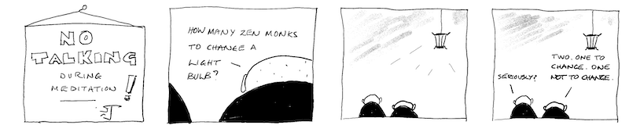

# Meet the Zen monks

In Jeff Borror’s classic textbook [*Q for Mortals*](https://code.kx.com/q4m3) you will find frequent references to moments of “Zen meditation” leading to flashes of insight into the workings of q. 

My teacher [Myokyo-ni](https://en.wikipedia.org/wiki/Myokyo-ni "Wikipedia") liked to quote Dogen-zenji:

> The Great Way is not difficult. It avoids only picking and choosing.

The [Do form of the Scan iterator](https://code.kx.com/q/ref/accumulators/#do) has a pattern I think of as ‘the Zen monks’.



* How many Zen monks does it take to change a lightbulb?
* Two. One to change it; one not to change it. 

The basic pattern is to apply a function and not to apply it. Consider the `trim` keyword. It must find the spaces in a string, then the continuous spaces from each end. If we had to write `trim` in q it might be

```q
q){b:x<>" ";(b?1b)_ neg[reverse[b]?1b] _ x}"   Trim the spaces.  "
"Trim the spaces."
```

We notice the repetitions:

* both `b` and `reverse[b]` are searched for `1b`
* two uses of the Drop operator 

We want to do the search/drop thing from both ends of the string. 

```q
q){x{y _ x}/1 -1*(1 reverse\" "<>x)?'1b}"   Trim the spaces.  "
"Trim the spaces."
```

Notice the `{y _ x}` reduction above. Lambda `{y f x}` commutes a function `f` by switching its arguments. The pattern `R{y f x}/L` successively applies a list of left arguments `L` to an argument `R`.

Here we use `1 reverse\` to get the boolean vector and its reversal. I think of this `1 f\` pattern as the Zen monks. 
Here is another use for it, in finding the shape (rows and columns) of a matrix.

```q
q)show m:{max[count each x]$'x}string`avoids`picking`and`choosing
"avoids  "
"picking "
"and     "
"choosing"
q)shp:{count each 1 first\x}  / shape of a matrix
q)shp m
4 8
```

The Zen Buddhist pension plan: 

> A day without work is a day without food.

Can you see any other work for the monks?