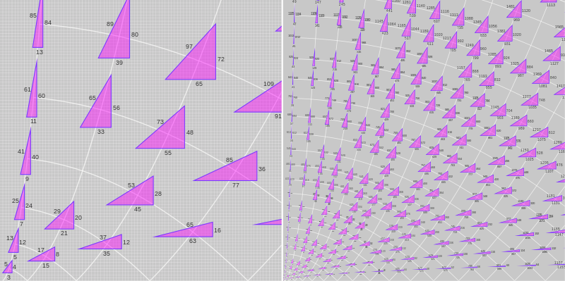

# 6. Special Pythogorean triple

https://projecteuler.net/problem=9




## Problem

A Pythagorean triple is a set of three natural numbers, $a < b < c$, for which

$$a^2 + b^2 = c^2$$

For example, $3^2 + 4^2 = 9 + 16 = 25 = 5^2$.

There exists exactly one Pythagorean triple for which $a + b + c = 1000$.
Find the product $abc$.


## Solution

[Euclid’s formula](https://en.wikipedia.org/wiki/Pythagorean_triple#Generating_a_triple) allows us to map integer pairs to Pythagorean triples.

An integer pair $(m,n)$ yields a Pythagorean triple

$$a = m^2 - n^2, b = 2mn, c  = m^2 + n^2$$

```q
sqr:{x*x}til 1000                   / cache some squares
dif:.[-]                            / difference
pt:{(dif sqr x;2*prd x;sum sqr x)}  / Pythagorean triple
```

A quick test confirms the upper bound for $m$ and $n$.

```q
q)pt 20 19
39 760 761

q)cmn:{x where (.[<>]') x} distinct desc each {x cross x} 1+til 20  / candidate m,n pairs
```

It remains only to find the one that sums to 1000.

```q
prd{x . (::;) first where 1000=sum x}pt flip cmn
```

## Notes

We wrote `pt` to return a triple from an integer pair, but implicit iteration in the primitives means `pt` works just as well on two integer vectors: we don’t nead to `pt each cmn`, just flip `cmn`.
The result is a 3-row matrix of triples, and `1000=sum` flags the column we need.

Rather than use index brackets with a long expression for the columns

```q
x[;blah blah blahdey blah ... ]
```

[Apply](https://code.kx.com/q/ref/apply) accepts a 2-item list in which the first item is the general null `::`. 

```q
x . (::;) blah blah blahdey blah ... 
```

Note the use of a list with a missing element, which here is syntactic sugar for the projection `enlist[::;]`.

## Postscript

I described this problem last weekend to my friend Nick, who teaches maths.
He stared out of the train window for a few minutes before turning back to me and telling me the triple. 

I am hoping to see an update from him here soon. 

[SJT]

---

Contributors 

* Stephen Taylor
