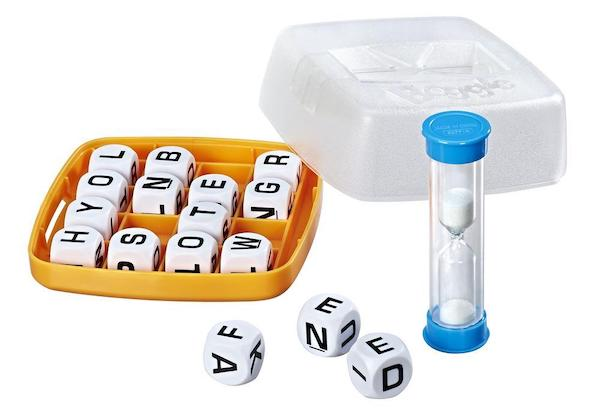

# Cheat at Boggle

[](https://shop.hasbro.com/en-us/product/boggle:7EB3363D-5056-9047-F5B7-DC51516DFE25 "Hasbro shop")


**Problem** For a given set of Boggle™ dice, throw a board. Identify the words that can be found on it and sort them alphabetically (ascending) within score (descending).

[Rules of Boggle](https://en.wikipedia.org/wiki/Boggle)


## Techniques

-   Download a word list from the Web
-   Generate random numbers
-   Project a function onto constant values
-   Iterate using [Each](https://code.kx.com/ref/maps)
-   Iterate using the [Converge](https://code.kx.com/ref/accumulators#converge) iterator

## Solution

```q
BOXES:()!()
BOXES[`new]:"AAEEGN ELRTTY AOOTTW ABBJOO EHRTVW CIMOTU DISTTY EIOSST DELRVY ACHOPS HIMNQU EEINSU EEGHNW AFFKPS HLNNRZ DEILRX"
BOXES[`old]:"AACIOT AHMORS EGKLUY ABILTY ACDEMP EGINTV GILRUW ELPSTU DENOSW ACELRS ABJMOQ EEFHIY EHINPS DKNOTU ADENVZ BIFORX"

VERSION:`old

DICE:" "vs BOXES VERSION
BS:"j"$sqrt count DICE                                  / board size

ce:count each
URL:"http://wiki.puzzlers.org/pub/wordlists/unixdict.txt"
UD:upper system"curl -s ",URL / Unix dictionary
BOGGLEDICT:ssr[;"QU";"Q"]each UD where ce[UD]<17        / Q for QU


both:{all flip x}

nb:{/ neighbors of position pair y in x by x board
  i:(.[cross] -1 0 1+/:y)except enlist y;
  i where both i within\:0,x-1 }

NB:BS{x sv flip nb[x;y]}'til[BS]cross til BS            / map board posns to neighbors

throw:{[dice](2#BS)#dice@'count[dice]?6}
BOARD:throw DICE

try:{[B;BD;state]
  si:state 0;                                           / strings as indexes of B
  wf:state 1;                                           / words found
  ns:raze{x,/:(NB last x)except x} each si;             / next strings to try
  ns:ns where B[ns]in count[first ns]#'BD;              / eliminate duds
  wf:distinct wf,{x where x in y}[B ns;BD];             / append new words found
  (ns;wf) }

solve:{[brd]
  b:raze brd;
  bd:BOGGLEDICT where all each BOGGLEDICT in b;         / board dictionary
  s:distinct{x 1}try[b;bd;]/[(enlist each til 16;())];  / solutions
  s:ssr[;"Q";"QU"]each s;                               / QU for Q
  s:{x idesc ce x}asc s;                                / sort asc alpha within desc size
  sc:(0 0 0 1 1 2 3 5,9#11)@ce s;                       / scores
  ok:where sc>0;                                        / throw the little ones back
  0N!"maximum score: ",string sum sc ok;
  $[`;s ok]!sc ok }
```


## Usage

```q
q)show board:throw DICE
"OMUY"
"MTUP"
"WSAY"
"ITVI"
q)solve board
"maximum score: 40"
MUTATIS| 5
TWIST  | 2
ASTM   | 1
ATOM   | 1
AUTO   | 1
MUST   | 1
PAST   | 1
..
```


## Discussion

Boggle boards have been made in different languages and sizes.
There are [old and new versions](https://www.boardgamegeek.com/thread/300565) of English dice for the 4×4 board.
Each die is defined by six letters.

We start with a dictionary of Boggle boxes.
Then we’ll pick the ‘old’ version.

```q
BOXES:()!()
BOXES[`new]:"AAEEGN ELRTTY AOOTTW ABBJOO EHRTVW CIMOTU DISTTY EIOSST DELRVY ACHOPS HIMNQU EEINSU EEGHNW AFFKPS HLNNRZ DEILRX"
BOXES[`old]:"AACIOT AHMORS EGKLUY ABILTY ACDEMP EGINTV GILRUW ELPSTU DENOSW ACELRS ABJMOQ EEFHIY EHINPS DKNOTU ADENVZ BIFORX"

VERSION:`old
```

Boggle sets come in different sizes.
From ``BOXES`old`` we find we have a 4×4 board.

```q
DICE:" "vs BOXES VERSION
BS:"j"$sqrt count DICE     / board size
```

Now we can throw the dice to get a board.

```q
q)throw:{[dice](2#BS)#dice@'count[dice]?6}
q)show board:throw DICE
"OAKB"
"DGLS"
"NSOY"
"HDZF"
```

To ‘solve’ the board we need to

-   generate candidate words
-   recognize English words

For the latter we’ll use the Puzzlers.org dictionary.

```q
URL:"http://wiki.puzzlers.org/pub/wordlists/unixdict.txt"
UD:upper system"curl -s ",URL  / Unix dictionary
```

!!! warning "Q and U"

    In English the letter Q is almost always followed by the letter U.
    On the Boggle board the two letters appear as one – `Qu` – and are scored as two letters when counting word lengths.

```q
BOGGLEDICT:ssr[;"QU";"Q"]each UD where ce[UD]<17
```

The Boggle dictionary has over 25,104 words. Many have letters not on the board just thrown.

```q
q)count bd:BOGGLEDICT where BOGGLEDICT{all x in y}\:raze board / board dictionary
557
```

Generating candidate words starts with each of the sixteen letters.
There are a limited number of paths, because letters may not be re-used.
So no solution word can have more than sixteen letters.

The set of all possible paths is a function of the board size, not its content.

We could generate all the possible paths for a 4×4 board, throw a board, and see which paths correspond to words.

Here are the 16 board positions as index pairs:

```q
q)til[BS]cross til BS
0 0
0 1
0 2
0 3
1 0
1 1
1 2
1 3
2 0
2 1
2 2
2 3
3 0
3 1
3 2
3 3
```

What are the neighbors of a position pair `y` in a `x` by `x` board ?

```q
both:{all flip x}
nb:{i:(.[cross] -1 0 1+/:y)except enlist y;i where both i within\:0,x-1}
```

List the neighbors for each of the 16 board positions.

```q
q)show NB:BS{x sv flip nb[x;y]}'til[BS]cross til BS
1 4 5
0 2 4 5 6
1 3 5 6 7
2 6 7
0 1 5 8 9
0 1 2 4 6 8 9 10
1 2 3 5 7 9 10 11
2 3 6 10 11
4 5 9 12 13
4 5 6 8 10 12 13 14
5 6 7 9 11 13 14 15
6 7 10 14 15
8 9 13
8 9 10 12 14
9 10 11 13 15
10 11 14
```

With `NB` we can extend any word path. Say our path position pairs are `(0 0;1 0;0 1)`, that is to say, board positions `0 4 1`. Then the possible extensions are `NB 1` excluding `0 4`.

```q
q){x,/:(NB last x)except x} 0 4 1
0 4 1 2
0 4 1 5
0 4 1 6
```

All the 2-letter word candidates on the board:

```q
q)raze[board] raze{x,/:NB x}each til 16
"OA"
"OD"
"OG"
"AO"
"AK"
"AD"
"AG"
..
```

Start with the 16 board positions, find their neighbors, repeat another 14 times, and we have all the paths through the board.

```q
q)count PATHS:15 {raze{x,/:(NB last x)except x} each x}\til 16
16
```

`PATHS 3` lists all the 4-letter paths; `PATHS 5` all the 4-letter paths, and so on. Over twelve million in all.

```q
q)ce PATHS
16 84 408 1764 6712 22672 68272 183472 436984 905776 1594648 2310264 2644520 ..
q)sum ce PATHS
12029640
```

Few of these paths through the current board correspond to dictionary words.

```q
q)raze[board] last PATHS
"OAKBLGDNSOSYFZDH"
"OAKBLGDNSHDOSYZF"
"OAKBLGDNSHDOSYFZ"
"OAKBLGDNSHDOZFYS"
"OAKBLGDNSHDOFZYS"
"OAKBLGDNSHDZOSYF"
"OAKBLGDNSHDZOFYS"
..
```

But we take all of them except the 1- and 2-letter words.

```q
q)count RP:raze 2_ PATHS  / razed paths
12029540
```

Now we can see which words in the board dictionary can be found along these paths.

```q
q)show wf:bd where bd in raze[board] RP / words found
"ADO"
"AGO"
"ALB"
"ALSO"
"DALY"
"DOG"
"FOG"
..
```

It remains to restore a `U` after each `Q`

```q
q)wf:ssr[;"Q";"QU"] each wf
```

and score and sort the results.

```q
q){x idesc x`score}([] word:wf; score:(0 0 0 1 1 2 3 5,9#11)@ce wf)
word     score
--------------
"FOLKSY" 3
"LAGOS"  2
"SLOSH"  2
"ADO"    1
"AGO"    1
```

This is a brutal approach. There is a substantial initial calculation to find the twelve million or so word paths in `RP`. Then for each board thrown these must be mapped into strings (`raze[board] RP`) so the few hundred words in the ‘board dictionary’ can be sought.

A smarter approach starts tracing the word paths but at each iteration eliminates strings that cannot become words. For example, a string `"AZX"` begins no word in the dictionary and need not be pursued.

For this we will use the [Converge iterator](https://code.kx.com/ref/accumulators#converge). The iterator applies a unary function to some initial state until the result stops changing.

```q
try:{[B;BD;state]
  si:state 0;                                 / strings as indexes of B
  wf:state 1;                                 / words found
  ns:raze{x,/:(NB last x)except x} each si;   / next strings to try
  ns:ns where B[ns]in count[first ns]#'BD;    / eliminate duds
  wf:distinct wf,{x where x in y}[B ns;BD];   / append new words found
  (ns;wf) }
```

Our ‘pursuit’ function operates upon a 2-item list `state`. The first item is the strings it is following, defined as indexes into the razed board. The second item is all the words found so far. The initial state is all the sixteen 1-letter strings on the board, and an empty list.

```q
(enlist each til 16;())
```

It refers at each iteration to the razed board and the board dictionary.
These are transient values, dependent on each throw of the board.
So in good functional style we project the function onto these values; within it they are constant for each iteration. Projected, our ternary (three-argument) function becomes a unary function that Converge can apply.
And Converge keeps on applying it until it finds no new strings to pursue.

Restoring `U`s to follow `Q`s, scoring and sorting much as above.

```q
solve:{[brd]
  b:raze brd;
  bd:BOGGLEDICT where all each BOGGLEDICT in b;         / board dictionary
  s:distinct{x 1}try[b;bd;]/[(enlist each til 16;())];  / solutions
  s:ssr[;"Q";"QU"]each s;                               / restore Us to Qs
  s:{x idesc ce x}asc s;                                / sort asc alpha within desc size
  sc:(0 0 0 1 1 2 3 5,9#11)@ce s;                       / scores
  ok:where sc>0;                                        / discard little ones
  0N!"maximum score: ",string sum sc ok;
  $[`;s ok]!sc ok }
```


