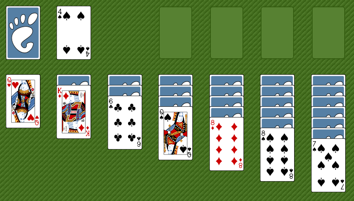

# Play Klondike




**Problem**
Play Klondike in the q session.

The last thing the world needs is another program to implement Solitaire, a.k.a. Klondike.
But here it is, as a case study for writing q programs.
A well-understood problem domain, small but non-trivial, is a good subject for close code reading.

[Rules of Klondike](https://en.wikipedia.org/wiki/Klondike_(solitaire) "Wikipedia")


## Techniques

-   Working with indexes
-   Working with nested lists
-   Boolean operator arguments as forms of conditional
-   Projection
-   Scattered indexing
-   [Apply and Apply At](https://code.kx.com/ref/apply)
-   Map iterators: [Each, Each Left](https://code.kx.com/ref/maps) and [`each`](https://code.kx.com/ref/each)


## Solution

Code and instructions at
[StephenTaylor-KX/klondike](https://github.com/StephenTaylor-KX/klondike).


## Cards

Represent cards as indexes into a canonical 52-card deck.

```q
SUITS:"SHCD"
NUMBERS:"A23456789TJQK"
SYM:`$NUMBERS cross SUITS           / card symbols
SYM,:`$("[]";"__")                  / hidden card; empty stack
HC:52                               / hidden card
ES:53                               / empty stack
SP:54                               / blank space

NUMBER:1+til[13]where 13#4          / card numbers
SUIT:52#SUITS                       / card suits
COLOR:"RB" SUIT in "SC"             / card colors
```

We add display symbols for hidden cards (face down) and an empty pile.

Also indexes for them and for a blank space in the display.


## Utilities

Certain expressions recur often enough to be abbreviated as utilities.

```q
ce:count each
le:last each
tc:('[til;count])
```

Syntactically, `ce` and `le`  are projections of the `each` keyword.
(Compare `double:2*`.)

`tc` is a composition, equivalent to the lambda `{til count x}`.


## Layout and game

Represent the layout as thirteen lists within a dictionary representing the game state.

```q
TURN:3                              / # cards to turn

STOCK:0
WASTE:1
FOUNDATION:2+til 4
TABLEAU:6+til 7

deal:{[]
  g:()!();
  deck:-52?52;
  / columns: stock, waste, 4 foundations, 7 piles
  g[`c]:13#enlist 0#0;
  g[`c;TABLEAU]:(sums til 7)_ 28#deck; / tableau
  g[`x]:le g[`c;TABLEAU]; / exposed
  g[`c;STOCK]:28_ deck;
  g[`s]:0; / score
  g[`p]:0; / # passes
  turn g }
```

The upper-case constants substitute for what would otherwise appear as numeric constants in the code.

‘The Cannon Test’ in [“Three Principles of Coding Clarity”](http://archive.vector.org.uk/art10009750 "The Journal of the British APL Association"), _Vector_ **26**:4

```q
q)g:deal[]
q)g
c | (6 8 42 21 27 13 11 22 48 26 2 10 15 16 25 45 28 23 1 24 20;44 31 35;`lon..
x | 12 0 14 46 38 33 29
s | 0
p | 0
pm| (1 7 2;1 1 10;1 11 10)

q)g`c
6 8 42 21 27 13 11 22 48 26 2 10 15 16 25 45 28 23 1 24 20
44 31 35
`long$()
`long$()
`long$()
`long$()
,12
41 0
4 30 14
32 50 34 46
3 40 7 9 38
19 18 17 36 43 33
51 39 49 47 37 5 29
```

The `turn` function is defined below. From the above, we surmise it turns `TURN` cards from the stock pile onto the waste pile, and returns a game dictionary.

It also writes possible moves as property `pm`, of which more below.

Entries in the game dictionary:

```txt
c   layout columns representing stock, waste, foundation and tableau
p   number of passes through the stock
pm  possible moves, a list of triples: # cards, from pile, to pile
s   score
x   cards exposed on the tableau
```


## Display

We need to interpret the game dictionary visually, showing

-   cards as symbols
-   face-down cards masked
-   possible moves as cards to be moved

```q
q)see g
21 [] 9D  __ __ __ __
0
4S [] [] [] [] [] []
   AS [] [] [] [] []
      4C [] [] [] []
         QC [] [] []
            TC [] []
               9H []
                  8H
"_____________________"
"score: 0"
AS
9D TC
9H TC
```


### Stock, waste, foundation

The first row of the display shows

-   the number of cards in the stock (21)
-   the stock cards face down `[]`
-   the top card exposed on the waste (9D)
-   the four empty piles of the foundation

The second row shows the number of passes through the stock (0).

There follows the tableau and a line. Below the line, the score and the two possible moves: 9D or 9H to TC.

```q
see:{[g] / display game
  / stock, waste, foundations
  top:@[;0;HC|]ES^le g[`c]STOCK,WASTE,FOUNDATION;
  show (`$string count[g[`c;STOCK]],g`p),'SYM 2 7#(2#top),SP,(2_ top),7#SP;
  / columns
  show SYM {flip x[;til max ce x]} {@[x; where 0=ce x; ES,]}
    {[g;c] g[`c;c]|HC*not g[`c;c] in g[`x]}[g] TABLEAU;
  show 21#"_";
  show "score: ",string g`s;
  show $[0=count g`pm; "No moves possible";
    {[g;n;f;t] SYM first each neg[n,1]#'g[`c;f,t]}[g;].'g`pm ]; }
```

To compose the first line, ``le g[`c] STOCK,WASTE,FOUNDATION`` finds the top card from six piles, returning nulls from empty piles. `ES^` replace the nulls with the index for an empty stack.
Apply At substitutes in the stock pile for anything but an empty stack.

[Apply At](https://code.kx.com/ref/apply#apply-at-index-at)

Note the three uses of projection.

-   ``g[`c] STOCK,WASTE,FOUNDATION`` is syntactically equivalent to ``g[`c;STOCK,WASTE,FOUNDATION]``, arguably a trivial and distracting use of projection. But we find ``g[`c]`` often indexed. The projection helps focus on what varies: the second index.
-   The ternary (three-argument) form of Apply At takes as third argument a unary; in this case the projection `HC|`.
-   Apply At is also projected, on its second and third arguments, again solely to separate them from the much longer expression which calculates the first argument. The projection `@[;0;HC|]` is a unary, and we can read it as “apply `HC|` to the first item of the argument”.

The following line applies the card symbols `SYM`, composes a 2&times;7 table, and prefixes it with the number of cards in the stock pile, and the number of passes made.
This requires little code and no comment.


### Tableau

The next line composes the display of the tableau. It is a long line and it looks intimidating.

> Q: Why is a line of my Java code so much easier to read than a line of q?
>
> A: Because the Java line isn’t doing very much.

```q
show SYM {flip x[;til max ce x]} {x,'(0=ce x)#'ES}
  {[g;c]g[`c;c]|HC*not g[`c;c]in g[`x]}[g] TABLEAU;
```

Its work is done by three lambdas, and we quickly see that it could have been written as three lines:

```q
a:{[g;c] g[`c;c]|HC*not g[`c;c] in g[`x]}[g] TABLEAU;
b:{x,'(0=ce x)#'ES} a;
show SYM {flip x[;til max ce x]} b;
```

Composing it as a single line eliminates `a` and `b`. It is a trade-off. The longer line is harder to read. On the other hand, a variable definition is a request to the the reader: Remember this for later. Eliminating the variables is a clear sign to the reader that the intermediate results are not used elsewhere.

The first lambda evaluated flags the exposed cards in the tableau columns and replaces the others with the hidden-card index.
Note how the implicit iteration of q’s atomic primitives do this without loops or control structures.

```q
q)g[`c;TABLEAU] in g`x
,1b
01b
001b
0001b
00001b
000001b
0000001b
q)g[`c;TABLEAU]|HC*not g[`c;TABLEAU] in g`x
,12
52 0
52 52 14
52 52 52 46
52 52 52 52 38
52 52 52 52 52 33
52 52 52 52 52 52 29
```

**Tip** Exploiting implicit iteration is a core skill in writing q. See how close the primitives get you to what you want before introducing iterators – let alone loops!

The second lambda, `{x,'(0=ce x)#'ES}`, replaces empty piles with the empty-stack symbol.
Using a boolean as the left argument of [Take](https://code.kx.com/ref/take) is a form of conditional.

For a long list with few 1s in the boolean the efficiency of Apply At would be better, because it would act only `where 0=ce x`.

```q
{@[x; where 0=ce x; ES,]}
```

Again, we see the ternary form of Apply At, with a projection (here `ES,`) as its unary third argument.

Indexing is also atomic. Simply applying `SYM` to this nested list of indexes produces a legible display.

```q
q)SYM g[`c;TABLEAU]|HC*not g[`c;TABLEAU] in g`x
,`4S
`[]`AS
`[]`[]`4C
`[]`[]`[]`QC
`[]`[]`[]`[]`TC
`[]`[]`[]`[]`[]`9H
`[]`[]`[]`[]`[]`[]`8H
```

But we want better. `{flip x[;til max ce x]}` produces it.
The flip is the transformation we want, but we cannot flip a general list, only a matrix.

```q
q)SYM {flip x[;til max ce x]} g[`c;TABLEAU]|HC*not g[`c;TABLEAU] in g`x
4S [] [] [] [] [] []
   AS [] [] [] [] []
      4C [] [] [] []
         QC [] [] []
            TC [] []
               9H []
                  8H
```

**Question** How did we lose the backtick symbols?

`x[;til max ce x]` changed the general list into a symbol matrix, which is displayed without backticks.


### Score, possible moves

The last part of the display is the possible moves. If there are any, they are visualized with

```q
{[g;n;f;t] SYM first each neg[n,1]#'g[`c;f,t]}[g;;;].'g`pm
```

We have here a quaternary lambda, projected on one argument; the Apply operator; and the Each iterator.

The possible moves are a list of triples. Each triple a number of cards, a from-column, and a to-column.

```q
q)g`pm
1 7  2
1 1  10
1 11 10
```

We see above a quaternary lambda `{[g;n;f;t] ... }` applied to this list of triples. But the lambda is first projected `{[g;n;f;t] ... }[g;;;]` locking in `g` as its constant first argument; so the projection is a ternary function. The ternary is then applied with the Apply and Each operators: `.'`.

The Apply operator makes the ternary function a unary of a list of its arguments. That is, `{[g;n;f;t] ... }[g;;;].` applied to the triple ``g[`pm;0]`` gets 1, 7, and 2 as arguments `n`, `f`, and `t`.  The Each iterator applies this unary to each item (triple) in the list ``g`pm``.

That is how the lambda is applied to `g` and the values in ``g`pm``. What does the lambda do? Say it is applied to `3 7 11`, i.e. move the last three cards from column 7 to column 11. `neg[n,1]` gives us `-3 -1` and we take the last three and the last one cards  respectively from ``g[`c;7]`` and ``g[`c;11]``. The first of each of these are, respectively the card to be moved and the card to which it is to be moved. 

It remains only to apply `SYM` to see the corresponding card symbols.


## Possible moves

Two kinds of moves are possible:

1.  to the foundation, from the waste or the tableau, a card of the same suit and next higher value to the target – and any ace may move to an empty column
2.  to the tableau, from the waste, tableau, or foundation, a card of different color and one lower value to the target card – and any king may move to an empty column

Only exposed cards may be moved. On the waste and foundation only the last card in a column is exposed. On the tableau, ``g`x`` lists exposed cards. Moving a card on the tableau moves with it all the cards below it.

With the globals defined at the beginning we have all we need to establish a card’s number, color and suit.

The rules above will suggest to many readers control structures and loops. They are not for us.
Instead, in `rpm`, we list all possible moves, and select any that conform.

The position of a card in the layout is given by a pair: its column index, and its position within that column. The unary `top` finds the positions of the top (last) cards in its argument columns, with no result items from empty columns.

```q
top:{(y,'i-1)where 0<i:ce x y}[g`c]; / positions of top cards
```


### To the foundation

```q
  fm:{[c;m]
    cards:c ./:m[;0 1]; / cards to move
    nof:SYM?`${(NUMBERS NUMBER x),'SUIT x}le c m[;2]; / next cards on foundation
    m where(cards=nof)or(NUMBER[cards]=1)and SUIT[cards]=SUITS FOUNDATION?m[;2]
  }[g`c] top[WASTE,TABLEAU] cross FOUNDATION;
```

The candidate moves to the foundation are:

```q
q)top[WASTE,TABLEAU] cross FOUNDATION
1  2 2
1  2 3
1  2 4
1  2 5
6  0 2
6  0 3
..
```

That gives us a list of triples: from-column, from-index, and to-column. We pass this list to a lambda as `m`; and the game columns ``g`c`` as `c`. For the moves, the cards to be moved are thus

```q
cards:c ./:m[;0 1];
```

??? tip "A list is a function of its indexes."

    The use here of Apply with an iterator again highlights a founding insight of q: _a list is a function of its indexes_. That has deep implications.

    Here we note only that Apply applies a function to its arguments or a list to its indexes – the syntax is the same.

`m[;0 1]` is a list of pairs. The first pair here is `1 2`. The first result item from ` ./:m[;0 1]` is thus `c . 1 2`, equivalent to `c[1;2]`, which is to say the third card from the second column.

**Tip** `c ./:m[;0 1]` is a form of scattered indexing.

The third column of `m` holds the indexes of the target (foundation) columns for the candidate moves.

The next code line defines `nof` (next on foundation), the corresponding card that _could_ be placed on that foundation pile.

```q
  nof:SYM?`${(NUMBERS NUMBER x),'SUIT x}le c m[;2];
```

The first index in `m[;2]` is 2, the first foundation index, i.e. Spades. If the top card on column 2 were 3S, the corresponding `nof` would be 4S.

**Question** The definition of `nof` contains no Add. How is the next value obtained?

The `NUMBER` list returns origin-1 numbers, e.g. a 1 for an ace indexes a `"2"` from `NUMBERS`.

The last line of the lambda

```q
    m where(cards=nof)or(NUMBER[cards]=1)and SUIT[cards]=SUITS FOUNDATION?m[;2]
```

returns items (triples) from `m` where either the card-to-be-moved is the next wanted on the foundation, or it is the ace of the suit for that foundation pile. (There is no need to see if the pile is empty. If the ace is available for moving, its foundation pile is empty.)

**Example** Aces next?

The last line of the lambda tests to see if a card _either_ matches its `nof` _or_ is an ace of the target column’s suit. That test (ace and suit) could be omitted if the `nof` list included aces. How could that be arranged? (Clue: `le c m[;2]` returns nulls from empty piles.)

Does the result read better?


### To the tableau

The above gave us a list of possible moves to the foundation. The next section of `rpm` produces a list of moves to the tableau.

```q
  xit:raze TABLEAU cross'where each g[`c;TABLEAU]in g`x; / positions exposed in tableau
  tm:{[c;m]
    cards:c ./:m[;0 1];
    tgts:le c m[;2];
    m where (.[<>;COLOR(cards;tgts)]and 1=.[-]NUMBER(tgts;cards))
     or (tgts=0N)and NUMBER[cards]=13
  }[g`c] (top[WASTE,FOUNDATION],xit) cross TABLEAU;
```

It follows a similar method. The two main differences are

-   the list of cards is the top cards from the waste and foundation piles, and also `xit`, the cards exposed in the tableau
-   target cards must be a different color and the next-higher value, or `0N` (from an empty pile) if the move card is an ace

Note how Apply is used to apply operators between pairs of lists.

```q
.[-]NUMBER(tgts;cards)      / NUMBER[tgts]-NUMBER cards
```

The code in `rpm` does a fair bit of looking up, and mapping from card IDs to suits, numbers and colors. For example, column numbers in `m[;2]` are found in the list of foundation columns and mapped to suits:

```q
SUITS FOUNDATION?m[;2]
```

The look-up is done by Find and the mapping by indexing, in this case specified simply by juxtaposition. 

Because indexing is atomic it maps implicitly across multiple lists, e.g. `NUMBER(tgts;cards)`.

We finish `rpm` by converting the from-column, from-index, to-index triples of `fm` and `tm` to the number-of-cards, from-column, to-column triples of ``g`pm``

```q
g[`pm]:{(ce[x y[;0]]-y[;1]),'y[;0 2]}[g`c] fm,tm;
```


## Move and turn

Two functions change the game state: `move` and `turn`.
(`turn` is also called by the game constructor `deal`.)
Both call `move_` to move cards between columns. Its job is to

-   move one or more cards
-   possibly expose a card on the tableau
-   adjust the game score

```q
move_:{[g;n;f;t]
  / move n cards in g from g[`c;f] to g[`c;t]
  g[`c;t],:neg[n]#g[`c;f];
  g[`c;f]:neg[n]_ g[`c;f];
  let:le g[`c;TABLEAU];
  g[`s]+:5 0@all let in g`x; / turned over tableau card?
  g[`x]:distinct g[`x],let;
  g[`s]+:$[f=WASTE; 5 10@t in FOUNDATION;
    f in TABLEAU; 0 10@t in FOUNDATION;
    f in FOUNDATION; -15;
    0 ]; / score
  rpm g }
```

Moving the cards is light work:

```q
  g[`c;t],:neg[n]#g[`c;f];
  g[`c;f]:neg[n]_ g[`c;f];
```

The scoring follows the original Windows implementation, as [described](https://en.wikipedia.org/wiki/Klondike_(solitaire)#Scoring "Wikipedia") in Wikipedia.

Once the game state has changed, `rpm` records the new possible moves.


### `turn`

The `turn` function has a simple move to make: three cards from the stock to the waste; fewer if there are fewer than three cards in the stock. And if there are none, to switch the stock and waste piles.

```q
turn:{[g;n]
  trn:0=count g[`c;STOCK];
  g[`c;STOCK,WASTE]:g[`c;trn rotate STOCK,WASTE];
  g[`p]+:trn; / # passes
  move_[g; n&count g[`c;STOCK]; STOCK; WASTE] }[;TURN]
```

The script sets `TURN` as 3; other versions of Klondike use different values.

As in the tableau display we used a boolean as the left argument of Take, so here we use it as the left argument of `rotate`, an effective conditional.


### `move`

The `move_` function does nothing to validate the specified move; it assumes it is valid. Validation is the job of `move`, which is part of the tiny user interface.

It takes as arguments the game state and one or two card symbols, e.g.

```q
g:move[g] `AS       / move AS to foundation
g:move[g] `KH       / move KH to an empty tableau pile
g:move[g] `9C`TH    / move 9C to TH on the tableau
g:move[g] `9C`TC    / move 9C to TC on the foundation
```

`move` has to

1.  validate its arguments
1.  validate the move
1.  call `move_`

To validate its arguments, it confirms the game is a dictionary with the keys expected, and that the move is one or two card symbols.

```q
  if[not 99h~type g; '"not a game"];
  if[not all `c`p`x`pm in key g; '"not a game"];
  if[abs[type y]<>11; '"type"];
  if[(type[y]>0)and 2<>count y; '"length"];
  if[not all b:y in SYM; '"invalid card: "," "sv string y where not b];
```

To call `move_` it must derive from the card symbols the number of cards to be moved, and the from- and to-columns.

```q
  cards:SYM?y;
  / map cards to n,f,t
  cl:ce g`c; / column lengths
  f:first where cl>i:g[`c]?'first cards; / from column
  n:cl[f]-i[f]; / # cards to move
  t:$[2=count cards; first where cl>g[`c]?'cards 1;
    $[1=NUMBER first cards; first[FOUNDATION]+SUITS?SUIT first cards;
      first[TABLEAU]+first where 0=ce g[`c;TABLEAU] ]
  ];
```

But first it must validate the proposed move.
That seems to call for logic expressing the rules on what can be moved where.

But no. Those rules have already been applied by `rpm` to record the possible moves for this game state in ``g`pm``. All `move` needs to do is confirm the proposed move is listed there.

```q
  if[not(n,f,t)in g`pm; '"invalid move"];
```

And we are done.


## Example usage

```q
q)see g:deal[]
21 [] 2S  __ __ __ __
0
4C [] [] [] [] [] []
   5D [] [] [] [] []
      6H [] [] [] []
         KD [] [] []
            2D [] []
               3D []
                  JH
"_____________________"
"score: 0"
2S 3D
4C 5D
3D 4C

q)see g:g move/(`2S`3D;`4C`5D;`3D`4C)
21 [] 9D  __ __ __ __
0
__ [] [] [] [] [] []
   5D [] [] [] [] []
   4C 6H [] [] [] []
   3D    KD [] [] []
   2S       2D 3H []
                  []
                  JH
"_____________________"
"score: 20"
2S 3H
KD

q)see g:move[g] `KD
21 [] 9D  __ __ __ __
0
KD [] [] [] [] [] []
   5D [] [] [] [] []
   4C 6H 5S [] [] []
   3D       [] [] []
   2S       2D 3H []
                  []
                  JH
"_____________________"
"score: 25"
2S 3H
5S 6H

q)see g:move[g] `5S`6H
21 [] 9D  __ __ __ __
0
KD [] [] [] [] [] []
   5D [] 4D [] [] []
   4C 6H    [] [] []
   3D 5S    [] [] []
   2S       2D 3H []
                  []
                  JH
"_____________________"
"score: 30"
2S 3H
4D 5S

q)see g:move[g] `4D`5S
21 [] 9D  __ __ __ __
0
KD [] [] 5H [] [] []
   5D []    [] [] []
   4C 6H    [] [] []
   3D 5S    [] [] []
   2S 4D    2D 3H []
                  []
                  JH
"_____________________"
"score: 35"
4C 5H
2S 3H

q)see g:turn g
18 [] 3C  __ __ __ __
0
KD [] [] 5H [] [] []
   5D []    [] [] []
   4C 6H    [] [] []
   3D 5S    [] [] []
   2S 4D    2D 3H []
                  []
                  JH
"_____________________"
"score: 35"
3C 4D
4C 5H
2S 3H
```


## Conclusion

That is all it takes to implement Klondike in the q session. What is there to notice about the code?

Plenty of iteration is involved, but very little is described in the code. Almost all of it is implicit in the q primitives, and the rest is specified with a handful of iterators: Each, Each Right and `each`. There are no `do` or `while` constructs whatsoever.

There is a good deal of mapping between lists, done very readably with indexing, such as 

```q
(NUMBER[cards]=1) and SUIT[cards]=SUITS FOUNDATION?m[;2]
```

Many choices are made, but `if` is used only to [validate arguments and signal errors](https://code.kx.com/q/style/conditionals "Remarks on Style"). [Cond](https://code.kx.com/q/ref/cond) appears a few times; many more choices are represented with boolean indexes or arguments to non-logical primitives, such as 

```q
"RB" SUIT in "SC"
5 10@t in FOUNDATION
(0=ce x)#'ES
```


## Further study

1.  Write an `autoplay` function that stops when the game is won or no more useful moves are possible.
2.  Write an HTML5 interface for the game engine. 
3.  Use the [Machine Learning Toolkit](https://code.kx.com/q/ml/toolkit/) to train a champion Klondike player.
4.  [“Three Principles of Coding Clarity”](http://archive.vector.org.uk/art10009750 "The Journal of the British APL Association"), _Vector_ **26**:4
5.  [Remarks on Style](https://code.kx.com/q/style/)

